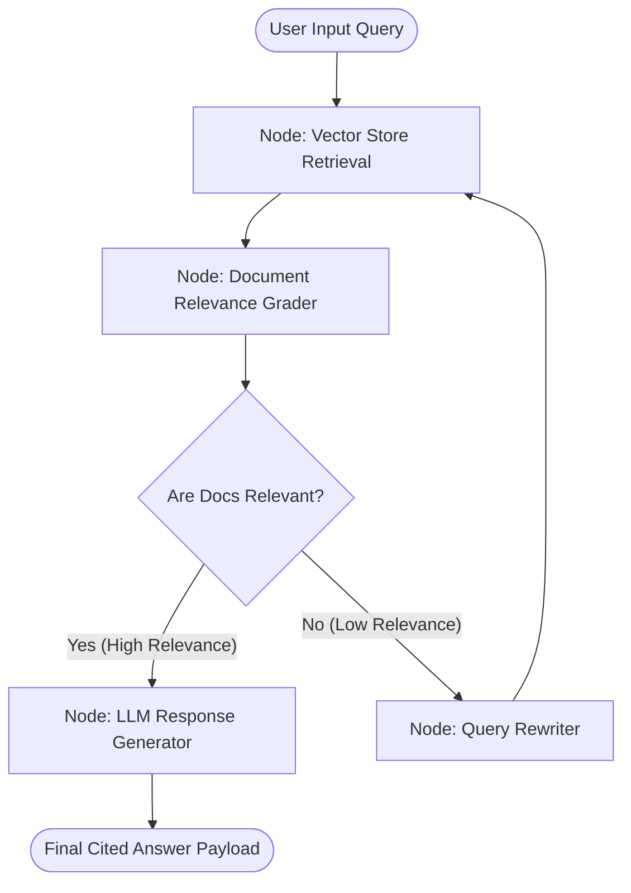

# How to Build Local Agentic RAG Workflows using LangGraph and Ollama

Traditional **Naive RAG** (Retrieval-Augmented Generation) architectures follow a rigid linear flow: user query $\rightarrow$ vector embedding lookup $\rightarrow$ context concatenation $\rightarrow$ single LLM generation pass. However, when handling ambiguous questions, multi-part technical queries, or domain-specific codebases, Naive RAG frequently returns low-relevance document chunks, leading to incomplete or hallucinated answers.

**Agentic RAG** solves this by introducing stateful decision loops. Using **LangGraph** alongside local **Ollama** runtimes, developers can construct multi-actor graphs that grade retrieved document relevance, rewrite poor search queries, and dynamically route execution paths.

In this step-by-step tutorial, you will learn how to build a fully self-correcting, local Agentic RAG pipeline in Python with zero cloud API keys.

---

## Agentic RAG Architecture & Cyclic State Graphs

Unlike basic chains, LangGraph models application workflows as cyclic graphs composed of **Nodes** (Python functions) and **Conditional Edges** (decision routing logic based on shared graph state).



### LangGraph State Schema

Every node in the graph receives and updates a shared typed state dictionary:

```python
from typing import List, TypedDict

class AgentGraphState(TypedDict):
    question: str
    documents: List[str]
    generation: str
    retry_count: int
```

---

## Step-by-Step Python Implementation

### Step 1: Environment & Dependency Installation

Install the required Python packages for LangGraph, LangChain, ChromaDB, and Ollama:

```bash
pip install langgraph langchain-community langchain-ollama chromadb sentence-transformers
```

Ensure your local Ollama daemon is running with your preferred local model:

```bash
ollama pull qwen2.5:7b
```

### Step 2: Vector Store Setup with ChromaDB

Initialize a local ChromaDB collection populated with technical documentation snippets:

```python
import chromadb
from langchain_community.vectorstores import Chroma
from langchain_community.embeddings import FastEmbedEmbeddings

# 1. Initialize local persistent embeddings
embeddings = FastEmbedEmbeddings(model_name="BAAI/bge-small-en-v1.5")

# 2. Populate Chroma vector store
docs_text = [
    "vLLM implements PagedAttention to eliminate memory fragmentation in KV cache management.",
    "LangGraph allows developers to create cyclic state graphs with conditional decision routing.",
    "DeepSeek R1 distilled models leverage reinforcement learning for step-by-step reasoning."
]

vectorstore = Chroma.from_texts(
    texts=docs_text,
    embedding=embeddings,
    collection_name="local_agentic_rag"
)

retriever = vectorstore.as_retriever(search_kwargs={"k": 2})
```

### Step 3: Defining Graph Nodes & LLM Interactions

Using `ChatOllama`, build the node functions for retrieval, relevance grading, generation, and query rewriting.

```python
from langchain_ollama import ChatOllama
from langchain_core.prompts import PromptTemplate

# Initialize local LLM engine
llm = ChatOllama(model="qwen2.5:7b", temperature=0)

# --- NODE 1: Document Retrieval ---
def retrieve(state: AgentGraphState):
    print("--- NODE: RETRIEVING DOCUMENTS ---")
    question = state["question"]
    documents = retriever.invoke(question)
    doc_texts = [d.page_content for d in documents]
    return {"documents": doc_texts, "question": question}

# --- NODE 2: Document Grader ---
def grade_documents(state: AgentGraphState):
    print("--- NODE: GRADING DOCUMENT RELEVANCE ---")
    question = state["question"]
    documents = state["documents"]
    
    grader_prompt = PromptTemplate(
        template="""You are a strict relevance grader. Evaluate if the document is relevant to the question.
Document: {document}
Question: {question}
Answer only 'yes' or 'no'.""",
        input_variables=["document", "question"]
    )
    
    filtered_docs = []
    for doc in documents:
        res = llm.invoke(grader_prompt.format(document=doc, question=question)).content.strip().lower()
        if "yes" in res:
            filtered_docs.append(doc)
            
    return {"documents": filtered_docs, "question": question}

# --- NODE 3: Response Generator ---
def generate(state: AgentGraphState):
    print("--- NODE: GENERATING ANSWER ---")
    question = state["question"]
    documents = state["documents"]
    
    gen_prompt = PromptTemplate(
        template="""Use the following retrieved context to answer the question accurately.
Context: {context}
Question: {question}
Answer:""",
        input_variables=["context", "question"]
    )
    
    context = "\n".join(documents)
    response = llm.invoke(gen_prompt.format(context=context, question=question)).content
    return {"generation": response}

# --- NODE 4: Query Rewriter ---
def transform_query(state: AgentGraphState):
    print("--- NODE: REWRITING QUERY ---")
    question = state["question"]
    retries = state.get("retry_count", 0) + 1
    
    rewrite_prompt = PromptTemplate(
        template="""Rephrase the technical search query to improve vector database retrieval performance.
Original Query: {question}
Optimized Query:""",
        input_variables=["question"]
    )
    
    better_question = llm.invoke(rewrite_prompt.format(question=question)).content.strip()
    return {"question": better_question, "retry_count": retries}
```

### Step 4: Assembling the LangGraph StateGraph

Wire nodes together with conditional logic to route between generation and rewriting loops:

```python
from langgraph.graph import END, StateGraph

# 1. Initialize StateGraph with typed schema
workflow = StateGraph(AgentGraphState)

# 2. Add Node instances
workflow.add_node("retrieve", retrieve)
workflow.add_node("grade_documents", grade_documents)
workflow.add_node("generate", generate)
workflow.add_node("transform_query", transform_query)

# 3. Build Graph Connections & Edges
workflow.set_entry_point("retrieve")
workflow.add_edge("retrieve", "grade_documents")

# Conditional Router Function
def decide_to_generate(state: AgentGraphState):
    filtered_docs = state["documents"]
    retries = state.get("retry_count", 0)
    
    if not filtered_docs and retries < 2:
        return "transform_query"  # Retry with rewritten query
    else:
        return "generate"         # Proceed to generation

workflow.add_conditional_edges(
    "grade_documents",
    decide_to_generate,
    {
        "transform_query": "transform_query",
        "generate": "generate"
    }
)

workflow.add_edge("transform_query", "retrieve")
workflow.add_edge("generate", END)

# 4. Compile Execution Graph
app = workflow.compile()
```

### Step 5: Graph Execution & Output Verification

Run the compiled LangGraph application against a sample prompt:

```python
if __name__ == "__main__":
    initial_state = {
        "question": "What memory optimization does vLLM use for KV cache?",
        "retry_count": 0
    }
    
    final_output = app.invoke(initial_state)
    print("\n--- FINAL AGENTIC RAG ANSWER ---")
    print(final_output["generation"])
```

---

## Production Best Practices for Local Agentic RAG

1. **Set Hard Loop Bounds**: Always track a `retry_count` in your graph state to prevent infinite rewrite loops if documents simply do not exist in the collection.
2. **Optimize Grader Latency**: Use fast, small models (such as `phi4-mini:3.8b` or `qwen2.5:1.5b`) for node graders to keep graph iteration latency below 500ms.
3. **Structured Output Enforcement**: Enforce JSON schema responses on grader nodes to guarantee consistent boolean parsing.

---

## Summary & Key Takeaways

- **Self-Correction**: Agentic RAG evaluates document quality *before* generation, preventing low-quality context from reaching end users.
- **Local Control**: Combining LangGraph, Ollama, and ChromaDB delivers fully autonomous enterprise AI agent workflows locally with zero recurring API costs.
