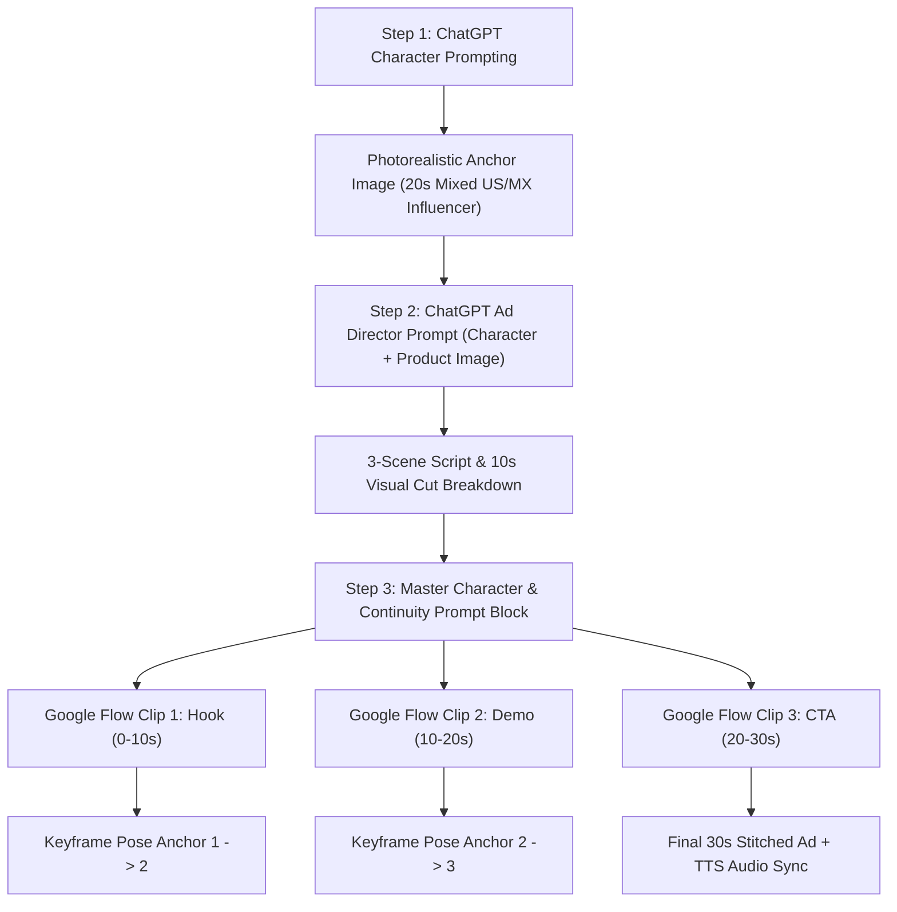

### Selected Folders
- **Selected Folder**: `src/content/tutorials/`
- **Why it is relevant**: This article provides an end-to-end developer and prompt engineering guide for generating photorealistic AI influencer characters with ChatGPT and directing multi-scene 30-second video advertisements in Google Flow without character drift.
- **Target keyword**: `google flow ai video ads character continuity tutorial`
- **Search intent**: Informational & step-by-step tutorial on building AI character video ads with visual continuity between discrete 10-second clips.

### Skipped Folders
- `src/content/comparisons/`: Skipped because the article focuses on execution architecture rather than benchmarking two competing video models.
- `src/content/news/`: Skipped because this is a practical workflow guide rather than a breaking release announcement.
- `src/content/tool-reviews/`: Skipped because priority is on prompt structure and continuity rules rather than scoring software products.

---

## Direct Answer: How to Build 30-Second AI Video Ads in Google Flow

> **To build a 30-second AI influencer video ad in Google Flow with zero character drift:**
> 1. Generate an initial photorealistic character reference image using ChatGPT/DALL-E 3 with explicit camera, lighting, skin texture, and aesthetic environment instructions.
> 2. Pass the character portrait and product image into ChatGPT to generate a 3-scene story script divided into 10-second segments.
> 3. Construct a reusable **Master Character & Continuity Block** defining clothing, face, apartment background, lighting, and camera lens.
> 4. Prefix each 10-second scene prompt in Google Flow with the Master Block and attach explicit ending keyframe pose constraints to seamlessly bridge clip boundaries.

---

## Technical Overview: The 3-Scene Video Continuity Pipeline

Generating video ads with generative video models like Google Flow presents a fundamental challenge: video generation models render short clips (typically 5 to 10 seconds) independently. Without explicit structural constraints, sequential clips suffer from **character drift**, **clothing changes**, **background shifts**, and **lighting jumps**.

The pipeline below solves this continuity problem by anchoring identity at the prompt engineering layer before execution in Google Flow:



---

## Step 1: Generating the Anchor AI Character in ChatGPT

The first phase of the pipeline is generating a consistent, high-fidelity anchor image. Generic AI prompts often produce glossy, plastic-looking CGI human renders that fail instantly as believable social media UGC (User Generated Content).

### Baseline Concept Prompt (Prompt 1)

For quick draft iterations, start with a conversational prompt:

```text
Hey, I'm planning to create an influencer-style video with a female character. I want her to be good-looking, in her 20s with mixed American and Mexican appearance.

She would be sitting on a sofa in wide frame with aesthetic, realistic background that feels like a real social media influencer setup but not like a podcast setup.

Can you please generate an image for this character?
```

### High-Realism Production Prompt (Prompt 2)

If Prompt 1 produces an overly polished or synthetic render, upgrade to an ultra-detailed photographic specification prompt. This prompt forces the image engine to simulate real camera optics, skin micro-texture, and ambient shadows:

```text
Create a highly photorealistic young female social media influencer in her mid-20s with a natural mixed American and Mexican appearance.

She has realistic facial proportions, naturally attractive features, expressive eyes, subtle asymmetry, realistic pores, fine skin texture, tiny natural imperfections, faint freckles, peach fuzz, natural lips, individual eyebrow hairs, and realistic hair strands. Avoid overly smooth or plastic-looking skin.

She is sitting casually on a comfortable modern sofa in a stylish but lived-in apartment. The environment should feel like a genuine lifestyle influencer's home rather than a professional studio or podcast setup.

Use a wide, natural camera framing that shows the woman from approximately the waist up while keeping plenty of the surrounding environment visible. She is relaxed and naturally posed, looking toward the camera as if recording a casual social media video.

The apartment has tasteful contemporary decor, a soft neutral color palette, plants, cushions, books, subtle wall art, warm lamps, natural materials, and small everyday details that make the space feel genuinely lived in.

REALISM IS THE PRIORITY:
- physically realistic skin texture
- visible pores and subtle imperfections
- natural facial asymmetry
- realistic hair density and individual strands
- realistic fabric weave and clothing texture
- authentic skin-to-light interaction
- natural shadows and ambient occlusion
- realistic reflections
- detailed eyes with natural moisture and reflections
- subtle under-eye texture
- realistic hands and fingers
- believable body proportions
- no artificial beauty-filter appearance
- no excessive makeup
- no perfect CGI skin
- no waxy or glossy skin
- no exaggerated facial features

Lighting should resemble a real high-end lifestyle photograph taken inside a real apartment: soft window light mixed with warm practical lighting, natural falloff, subtle shadows, realistic exposure and color temperature.

Camera characteristics should resemble a professional full-frame mirrorless camera with a realistic 35mm lens, natural depth of field, subtle background separation, realistic optical characteristics, slight lens imperfections, natural dynamic range, and fine photographic grain.

The final image should look like an authentic photograph of a real person captured for Instagram, TikTok, or YouTube — not an AI-generated character, CGI render, 3D model, beauty advertisement, or studio portrait.

Ultra-detailed, photorealistic, natural skin, realistic textures, cinematic but believable, authentic lifestyle photography, true-to-life colors.
```

---

## Step 2: Ad Direction & Multi-Scene Storyboarding

Once your anchor image is rendered, pair the character portrait with your target product photo (e.g. a skincare face cream jar). Feed both images back into ChatGPT with the following director prompt:

```text
This is my AI influencer, and I’d like to create a 30-second ad with her for this product. I’ll be generating the video using Flow, which creates 10-second clips, so I’d like you to direct the ad as three separate 10-second scenes.

Please describe what should happen in each 10-second segment, with smooth continuation from one clip to the next. Keep the character, appearance, outfit, environment, camera style, and overall visual style consistent throughout all three clips so they feel like one continuous video.

Make sure you use a script section for voice script so that the same prompt can be reusable.
```

---

## Step 3: Reusable Google Flow Master Prompt Architecture

Google Flow generates video sequentially in 10-second chunks. To guarantee continuous identity across clips, structure your prompt into **two discrete layers**:

1. **Master Character & Continuity Block**: Pre-pended to every clip prompt to lock character geometry, clothing, room layout, lighting, and camera optics.
2. **Scene Action & Isolated Voice Script**: Dictates physical micro-movements, product handling, and voiceover copy for that specific 10-second window.

```text
┌─────────────────────────────────────────────────────────┐
│        MASTER CHARACTER & CONTINUITY BLOCK              │
│ (Face + Outfit + Room + Lighting + Lens + Camera Shot)  │
└─────────────────────────────────────────────────────────┘
                            │
        ┌───────────────────┼───────────────────┐
        ▼                   ▼                   ▼
┌───────────────┐   ┌───────────────┐   ┌───────────────┐
│ SCENE 1 (0-10s)│   │ SCENE 2 (10-20s│   │ SCENE 3 (20-30s│
│ Hook & Intro  │   │ Application   │   │ Result & CTA  │
│ Voice Script  │   │ Voice Script  │   │ Voice Script  │
└───────────────┘   └───────────────┘   └───────────────┘
```

---

## Step 4: Full 30-Second Face Cream Commercial Prompt Template

Below is the complete, production-ready Google Flow prompt structure ready for deployment:

### MASTER CHARACTER & CONTINUITY — USE FOR ALL 3 CLIPS

```text
Character:
A highly photorealistic young female social media influencer in her mid-20s. She has a naturally attractive mixed American/Mexican appearance, realistic facial proportions, expressive brown eyes, naturally shaped lips, subtle facial asymmetry, realistic pores and skin texture, faint natural freckles, fine peach fuzz, individual eyebrow hairs and realistic individual hair strands. Her appearance must remain exactly consistent across all three clips. Do not change her face, age, body proportions, hairstyle, skin tone or facial features.

She has long, naturally wavy dark brown hair, parted slightly off-center, falling loosely over her shoulders and down one side of her chest.

Outfit:
White fitted ribbed tank top, light gray relaxed lounge pants, delicate gold necklace with a small pendant and small gold hoop earrings. The outfit remains completely unchanged throughout all three clips.

Environment:
A warm, modern, lived-in apartment. She is seated casually on the same cream-colored fabric sofa shown in the reference image. A large olive-green cushion is positioned to her right and a textured cream-and-black cushion is visible to her left. A soft knitted cream blanket rests on the left side of the sofa.

Behind her is the same open-plan apartment with a warm neutral color palette, large decorative mirror, indoor plant, kitchen island and dark kitchen cabinetry. Warm pendant lights are glowing in the background.

Lighting:
Warm natural daylight mixed with soft warm interior lighting. Soft flattering light on her face. Natural shadows. No dramatic studio lighting. Keep the exact same lighting direction, brightness and color temperature throughout all three clips.

Visual style:
Premium photorealistic lifestyle skincare advertisement. Natural influencer content rather than a traditional commercial. Cinematic but believable. Warm beige, cream, olive and brown color palette. Realistic skin texture. Shallow depth of field. Subtle background bokeh. No artificial beauty filter, no plastic skin, no excessive retouching.

Camera:
Vertical 9:16 social-media advertisement. Photorealistic cinematic camera. Medium shot framing from approximately waist/chest level upward. Camera positioned directly in front of her with a very subtle natural handheld feel. 50mm-style perspective, shallow depth of field. Slow, almost imperceptible camera movement. Keep camera height, lens perspective and overall composition consistent between clips.

Performance:
She behaves like a confident but relaxed beauty/lifestyle influencer speaking naturally to her audience. Friendly eye contact with the camera, subtle facial expressions, natural blinking, realistic breathing and small hand gestures. Avoid exaggerated influencer movements. Her gestures should feel spontaneous and conversational.

Important continuity rule:
The three clips are not separate scenes with different setups. They are three consecutive pieces of the same continuous conversation. Her body position, hairstyle, clothing, environment, lighting, camera position and visual style must remain consistent. The ending pose and hand position of each clip should naturally lead into the beginning of the next clip.
```

---

### SCENE 1 — HOOK / INTRODUCTION (0–10 seconds)

```text
Visual direction:
Begin with the influencer already seated comfortably in the exact position from the reference image.
She looks directly into the camera with a subtle friendly smile. She begins speaking naturally. During the first few seconds, she makes small conversational hand gestures while maintaining eye contact.
Around the middle of the clip, she reaches naturally toward a small face cream jar positioned on the coffee table just in front of her, slightly below camera frame.
She picks up the Natural Glow Face Cream jar and brings it into the frame.
The jar should match the supplied product reference: small round green-and-white cosmetic jar containing white cream, with the same overall packaging appearance and label design.
She holds the jar naturally near chest level while continuing to speak.
At the end of the clip, she is holding the jar in her right hand near her chest, looking at the camera.

Ending continuity position:
Freeze the action naturally with her holding the product near her chest. Do not put the product down.

SCRIPT — VOICE:
"Okay, this has honestly become one of my favorite little parts of my skincare routine. I’ve been using this Natural Glow Face Cream lately, and I really love how simple it feels."

Voice style:
Young female influencer voice, warm, conversational, confident, natural American English. Not overly enthusiastic. No announcer voice. Speak at a comfortable conversational pace.
```

---

### SCENE 2 — PRODUCT / APPLICATION (10–20 seconds)

```text
Continuation from Scene 1:
Begin exactly where Scene 1 ended.
She is still seated on the same sofa, wearing exactly the same outfit, holding the same face cream jar in her right hand at approximately chest level.
Do not reset the scene.
She looks briefly down at the product, smiles, then opens the jar naturally.
She uses her other hand to scoop a very small amount of the white cream onto her fingertip.
She brings the cream toward her face and gently demonstrates applying a small amount to her cheek.
Her movements are slow, natural and elegant. She lightly blends the cream into her cheek using her fingertips while looking between the camera and her reflection/hand.
Keep her facial expression relaxed and genuine.
The camera makes a very subtle slow push-in during the demonstration, maintaining the same perspective and warm cinematic look.
Do not create an extreme skincare close-up. Keep the influencer recognizable throughout the demonstration.
At the end, she lowers her hand slightly and looks directly back into the camera with a soft smile.

Ending continuity position:
She finishes blending the cream, lowers her hand naturally and faces the camera. The product remains visible in her other hand or is placed naturally beside her without changing the environment.

SCRIPT — VOICE:
"I love that it feels lightweight and gives my skin that nice, hydrated feeling without making it feel heavy. And the aloe vera and vitamin E are such a nice touch."
```

---

### SCENE 3 — RESULT / CTA (20–30 seconds)

```text
Continuation from Scene 2:
Begin with the influencer in the exact same seated position and environment.
She looks directly into the camera with a relaxed smile.
She lightly touches her cheek for a moment, then gestures naturally toward the face cream.
She brings the product slightly closer toward the camera for a brief product-focused moment, keeping her face visible in the background.
The camera performs a very subtle push-in as she delivers the final line.
She then brings the product back toward herself and finishes with a natural confident smile directly at the camera.
End on a clean, warm lifestyle-commercial frame with her holding the product near her chest.
No dramatic transition. No change of location. No wardrobe change. No change of lighting.

SCRIPT — VOICE:
"If you’re looking for an easy everyday moisturizer, this is definitely one I’d keep in my routine. Natural Glow Face Cream — simple skincare, beautiful glow."
```

---

## Comparison Matrix: Prompt Strategies for AI Video Continuity

| Prompting Dimension | Generic AI Video Prompt | Master Continuity Block Architecture |
| :--- | :--- | :--- |
| **Character Face Consistency** | Shifts features and ethnicity between clips | Rigidly locked via facial ratio & ethnic descriptors |
| **Wardrobe & Props** | Random shirt colors and disappearing accessories | Fixed tank top, gold necklace, and cushion props |
| **Camera Optical Feel** | Jarring zoom jumps & focal length shifts | Constant 50mm perspective & waist-up framing |
| **Ending Keyframes** | Abrupt end cuts that ruin transitions | Explicit posture freeze bridging Clip $N \rightarrow N+1$ |
| **Script Reusability** | Text embedded directly into video prompts | Isolated SCRIPT section reusable across products |

---

## Key Takeaways

1. **Lock baseline optics in Step 1**: Use detailed camera prompts (35mm/50mm lens, 9:16 aspect, soft natural lighting) to prevent synthetic CGI artifacts.
2. **Isolate visual direction from voice scripts**: Keep visual descriptors separate from vocal dialogue so you can swap ad scripts across localized campaigns without re-rendering character frames.
3. **Use ending keyframe posture anchors**: Explicitly tell Google Flow where hands and torso end in Clip 1 so Clip 2 begins seamlessly from the exact same spatial coordinate.
4. **Maintain constant camera elevation**: Keep the camera at eye level (waist/chest height) with subtle handheld micro-movements to emulate real phone recording.

---

## Download Resources & Prompt Checklists

For instant offline access to this full prompt template, download our step-by-step developer cheat sheet from the Nadhebe Resource Library:

📥 **[Google Flow AI Video Ads Master Prompt & 3-Scene Continuity Guide (PDF)](/resources/google-flow-ai-ads-script-guide.pdf)** — *Instant PDF Download & Live Markdown Preview available at [/resources/](/resources/).*

---

## Image Assets & Production Specifications

* **Hero Image**:
  - **Placement**: Article header (`heroImage`)
  - **Filename**: `ai-character-video-ads-google-flow-hero.png`
  - **Alt Text**: Minimalist vintage editorial illustration representing AI character video ads and Google Flow storyboard on soft olive background
  - **Caption**: Vintage editorial collage depicting AI video ad generation and camera viewport framing.
  - **Purpose**: Establishes visual topic authority for Google Flow AI influencer ad creation.
  - **Aspect Ratio**: 16:9

* **Supporting Visual 1**:
  - **Placement**: Under Step 1 (Photorealistic Anchor AI Character)
  - **Filename**: `storyboard-tutorial-hero.webp`
  - **Alt Text**: Interface screenshot showing sequence of storyboard frames in Google Flow
  - **Caption**: Multi-scene storyboard panel sequence anchored by reference character assets.
  - **Purpose**: Demonstrates visual panel sequence extraction.
  - **Aspect Ratio**: 16:9

* **Supporting Visual 2**:
  - **Placement**: Under Step 3 (Master Character & Continuity Architecture)
  - **Filename**: `google-flow-hero.webp`
  - **Alt Text**: Graphical workflow breakdown of Google Flow video prompt architecture
  - **Caption**: Master Character block inherited across 10-second video clips.
  - **Purpose**: Visualizes prompt inheritance for multi-clip consistency.
  - **Aspect Ratio**: 16:9

---

## Related Production Guides

* Learn how to structure pre-production storyboards in [How to Use Google Flow Storyboard Studio](/tutorials/building-pre-production-storyboards-google-flow).
* Explore local video generation workflows in [Run Flux 1 Locally on Consumer GPUs](/tutorials/run-flux-1-locally-consumer-gpu).
* Review full system prompt guardrails in our [LLM System Risk & Guardrail Audit Checklist](/resources/).
