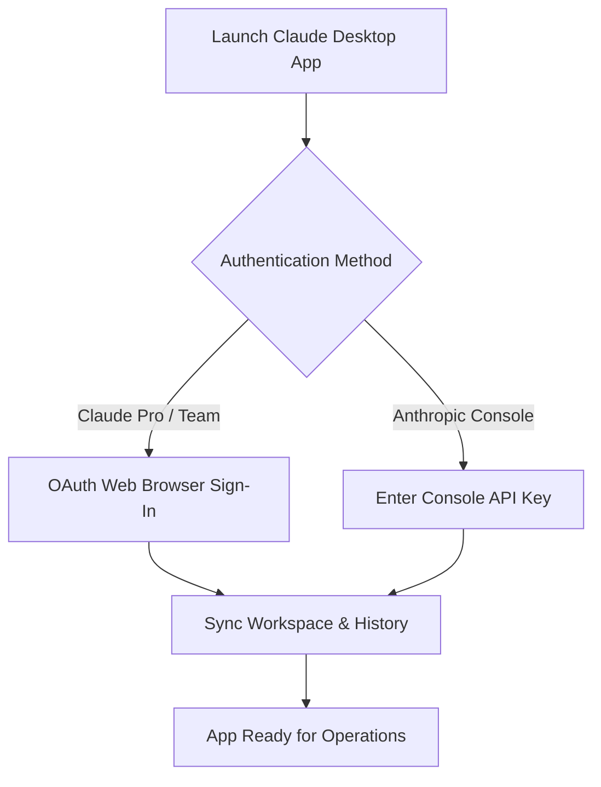

Anthropic's **Claude Desktop** application brings conversational AI, autonomous file analysis, and local tool execution directly to your native operating system. Unlike web browser interfaces, Claude Desktop runs as a dedicated application on **macOS** and **Windows**, providing local filesystem access, menu bar shortcuts, global hotkey triggers, and seamless **Model Context Protocol (MCP)** server integration.

This guide provides step-by-step instructions for downloading, installing, configuring, and optimizing Claude Desktop across macOS and Windows.

---

## Operating System Matrix: Claude Desktop vs Claude Code CLI

| Feature / Capability | Claude Desktop (GUI App) | Claude Code CLI (Terminal Agent) | Web Client (`claude.ai`) |
| :--- | :--- | :--- | :--- |
| **Primary Interface** | Native GUI Window / Menu Bar | POSIX Terminal Shell | Web Browser Tab |
| **Local File Access** | User-granted directory mounts | Direct workspace filesystem access | File attachment upload |
| **MCP Server Support** | `claude_desktop_config.json` | `.mcp.json` / CLI flags | None |
| **Target User** | Designers, Writers, Analysts | Software Developers & DevOps | General Knowledge Workers |
| **Supported OS** | macOS 12+ & Windows 10/11 | macOS, Linux, WSL2 | Any Web Browser |

---

## Step 1: Downloading & Installing Claude Desktop

Always download installer packages directly from Anthropic's verified domain to prevent downloading tampered binaries.

### Installing on macOS (Apple Silicon & Intel)

#### Method A: Direct Installer Download
1. Visit the official portal: `claude.ai/download`.
2. Click **Download for macOS** (`Claude-Setup.dmg`).
3. Open the `.dmg` file and drag **Claude** into your `/Applications` directory.
4. Launch Claude from Spotlight (`Cmd + Space` -> *Claude*).

#### Method B: Homebrew Cask Package Manager
If you manage macOS software via Homebrew, execute:

```bash
brew install --cask claude
```

To update Claude Desktop in the future:

```bash
brew upgrade --cask claude
```

---

### Installing on Windows 10 & 11

1. Visit `claude.ai/download` and select **Download for Windows** (`Claude-Setup.exe`).
2. Run the `.exe` installer. The application extracts into your user-space `%LOCALAPPDATA%\Programs\Claude` directory without requiring Administrator privileges.
3. Launch Claude from the Windows Start Menu or Taskbar.

---

## Step 2: Initial Setup & API Credential Sync

Upon first launch, Claude Desktop prompts you to sign in:



1. **Claude Pro & Team Accounts:** Click **Sign In with Browser** to authorize your existing subscription.
2. **Anthropic Console API Users:** Enter your API Key (`sk-ant-api03...`) to enable pay-as-you-go usage.

---

## Step 3: Configuring Local MCP Servers (`claude_desktop_config.json`)

One of the most powerful features of Claude Desktop is its native support for **Model Context Protocol (MCP)** servers, allowing Claude to interact with local databases, GitHub repositories, Google Drive, and local filesystem tools.

### Configuration File Locations

Edit the configuration file based on your operating system:

* **macOS:** `~/Library/Application Support/Claude/claude_desktop_config.json`
* **Windows:** `%APPDATA%\Claude\claude_desktop_config.json` (`C:\Users\<Username>\AppData\Roaming\Claude\claude_desktop_config.json`)

### Example `claude_desktop_config.json` Schema

Open or create `claude_desktop_config.json` and add your local tool configurations:

```json
{
  "mcpServers": {
    "filesystem": {
      "command": "npx",
      "args": [
        "-y",
        "@modelcontextprotocol/server-filesystem",
        "/Users/alice/projects",
        "/Users/alice/documents"
      ]
    },
    "github": {
      "command": "npx",
      "args": [
        "-y",
        "@modelcontextprotocol/server-github"
      ],
      "env": {
        "GITHUB_PERSONAL_ACCESS_TOKEN": "github_pat_your_token_here"
      }
    },
    "postgres": {
      "command": "npx",
      "args": [
        "-y",
        "@modelcontextprotocol/server-postgres",
        "postgresql://localhost:5432/analytics_db"
      ]
    }
  }
}
```

Restart the Claude Desktop application after saving changes. A hammer icon 🛠️ will appear in the input bar confirming connected MCP tools.

---

## Step 4: Local Directory & Filesystem Permissions

Claude Desktop enforces strict OS-level sandbox permissions before accessing local folders.

### Granting Directory Access

1. Open **Settings** inside Claude Desktop (`Cmd + ,` on Mac or `Ctrl + ,` on Windows).
2. Navigate to **Local Filesystem Permissions**.
3. Click **Add Directory** and select your project or documents folder.
4. Claude can now search, read, and create documents inside specified directories without prompting for manual file uploads.

---

## Step 5: Global Hotkeys & Shortcuts

Boost daily productivity using native desktop shortcuts:

| Action | macOS Shortcut | Windows Shortcut |
| :--- | :--- | :--- |
| **Open Quick Chat Overlay** | `Option + Space` | `Alt + Space` |
| **Open App Preferences** | `Cmd + ,` | `Ctrl + ,` |
| **New Conversation** | `Cmd + N` | `Ctrl + N` |
| **Attach File / Folder** | `Cmd + Shift + U` | `Ctrl + Shift + U` |
| **Toggle Menu Bar Window** | `Cmd + Shift + C` | `Ctrl + Shift + C` |

---

## Troubleshooting Common Installation Issues

### 1. Claude Desktop Fails to Launch on Windows
**Fix**: Verify that Microsoft Edge WebView2 Runtime is installed. Download it from Microsoft's official developer portal if missing.

### 2. MCP Server Hammer Icon Missing
**Fix**: Check syntax errors in `claude_desktop_config.json` using a JSON validator. Ensure Node.js (`npx`) is accessible in your system `PATH`.

---

## Related Guides & Workflows

* For terminal-native AI coding, read [Claude Code Cheat Sheet: Commands, Shortcuts & Flags](/tutorials/claude-code-cheat-sheet-commands-shortcuts).
* For desktop agentic workflow deep dives, see [What is Claude Cowork? Desktop Agent Guide](/guides/claude-cowork-desktop-agent-guide).
* For cross-platform CLI setups, explore [How to Install and Set Up Claude Code CLI](/tutorials/how-to-install-claude-code-cli).
