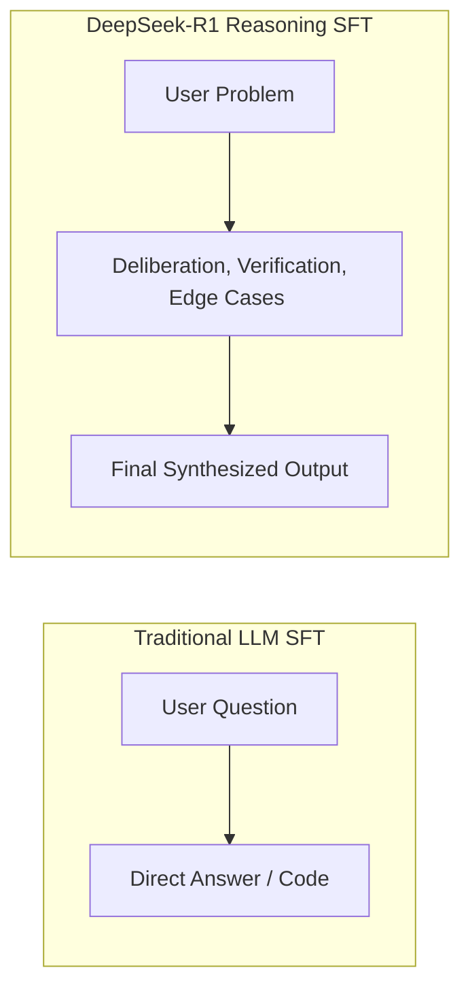

The release of **DeepSeek-R1** democratized frontier-grade reasoning, proving that reinforcement learning with verifiable rewards could unlock o1-level performance in open-weights models. However, out of the box, DeepSeek-R1's distilled models (Llama-8B, Qwen-14B) are generalists. To adapt their deep analytical reasoning to proprietary enterprise schemas, medical diagnostic logs, or custom domain algorithms, fine-tuning is required.

Historically, fine-tuning reasoning models required massive multi-GPU clusters. Thanks to **Unsloth's** ultra-optimized Triton kernels and memory-efficient QLoRA integration, you can now fine-tune **DeepSeek-R1-Distill-Llama-8B** on a single consumer GPU with just 16GB or 24GB of VRAM.

---

## What is Unsloth Reasoning Fine-Tuning?

Unsloth reasoning fine-tuning is an optimized training methodology that applies parameter-efficient 4-bit QLoRA adaptation to distilled chain-of-thought models like DeepSeek-R1. It replaces standard PyTorch autograd operations with custom fused Triton kernels, slashing VRAM overhead by 80% while training 2x to 5x faster than standard Hugging Face PEFT/TRL pipelines.

The critical requirement when fine-tuning reasoning models is preserving the internal **cognitive deliberation phase**. Unlike standard conversational LLMs that map directly from `Prompt -> Output`, DeepSeek-R1 must be trained on datasets containing explicit `<think> ... </think>` blocks before the final synthesis.



---

## Hardware Prerequisites & Memory Allocation Matrix

Before launching your training run, verify that your GPU meets the minimum VRAM specifications for your target context length:

| Target Model | Quantization | Context Window | Minimum VRAM | Recommended Consumer GPU |
| :--- | :--- | :--- | :--- | :--- |
| **DeepSeek-R1-Distill-Qwen-1.5B** | 4-bit QLoRA | 4,096 tokens | 6 GB | RTX 3060 / RTX 4060 |
| **DeepSeek-R1-Distill-Llama-8B** | 4-bit QLoRA | 4,096 tokens | **14 GB** | **RTX 3090 / 4080 / 4090** |
| **DeepSeek-R1-Distill-Qwen-14B** | 4-bit QLoRA | 2,048 tokens | **20 GB** | **RTX 3090 / RTX 4090 (24GB)** |
| **DeepSeek-R1-Distill-Qwen-32B** | 4-bit QLoRA | 2,048 tokens | 48 GB | 2x RTX 3090 or A6000 |

If you plan to run local inference first to evaluate base model speed, check our setup tutorial on [Running DeepSeek-R1 Locally with Ollama](/tutorials/run-deepseek-r1-locally-ollama/).

---

## Step 1: Environment Setup & Unsloth Installation

To prevent CUDA kernel mismatch errors, install Unsloth in an isolated Python 3.10 or 3.11 virtual environment.

```bash
# Create and activate python virtual environment
python -m venv unsloth-env
source unsloth-env/bin/activate  # On Windows: unsloth-env\Scripts\activate

# Install PyTorch with CUDA 12.1+ support
pip install torch torchvision torchaudio --index-url https://download.pytorch.org/whl/cu121

# Install Unsloth, Xformers, and TRL
pip install "unsloth[colab-new] @ git+https://github.com/unslothai/unsloth.git"
pip install --no-deps "xformers<0.0.27" "trl<0.9.0" peft accelerate bitsandbytes
```

---

## Step 2: Initializing Model and FastLanguageModel Config

Unsloth provides pre-quantized 4-bit checkpoints that cut download times from 30GB to under 5GB.

```python
import torch
from unsloth import FastLanguageModel

max_seq_length = 4096  # Supports up to 8192 with RoPE scaling
dtype = None           # Auto-detect: Float16 for Turing/Ampere, Bfloat16 for Ada/Hopper
load_in_4bit = True    # Enables 4-bit QLoRA

# Load DeepSeek-R1-Distill-Llama-8B
model, tokenizer = FastLanguageModel.from_pretrained(
    model_name="unsloth/DeepSeek-R1-Distill-Llama-8B",
    max_seq_length=max_seq_length,
    dtype=dtype,
    load_in_4bit=load_in_4bit,
)

# Attach LoRA adapters to all attention and MLP projection layers
model = FastLanguageModel.get_peft_model(
    model,
    r=16,                         # LoRA Rank (16 to 64 recommended)
    target_modules=[
        "q_proj", "k_proj", "v_proj", "o_proj",
        "gate_proj", "up_proj", "down_proj"
    ],
    lora_alpha=16,                # LoRA scaling factor
    lora_dropout=0,               # Unsloth recommends 0 for optimized fused kernels
    bias="none",
    use_gradient_checkpointing="unsloth", # Saves up to 60% VRAM
    random_state=3407,
)
```

---

## Step 3: Structuring Reasoning Datasets with Explicit `<think>` Tags

The golden rule of fine-tuning DeepSeek-R1: **Never remove `<think>` tokens from target completions**. Your training examples must follow this exact prompt template:

```json
{
  "instruction": "Design an idempotent PostgreSQL schema for webhook event deduplication.",
  "reasoning": "First, consider what idempotency requires: unique delivery IDs. We must store the provider's event_id along with a unique constraint. Second, think about race conditions where concurrent webhooks fire at the exact same millisecond. We need an ON CONFLICT DO NOTHING clause or an explicit advisory lock. Third, account for table growth: high-velocity webhooks require timestamp partitioning.",
  "output": "CREATE TABLE webhook_events (\n    id BIGSERIAL PRIMARY KEY,\n    event_id VARCHAR(255) NOT NULL,\n    provider VARCHAR(50) NOT NULL,\n    payload JSONB NOT NULL,\n    processed_at TIMESTAMPTZ DEFAULT NOW(),\n    CONSTRAINT uq_provider_event UNIQUE (provider, event_id)\n);\nCREATE INDEX idx_webhooks_processed ON webhook_events (processed_at);"
}
```

### Dataset Formatting Script

```python
from datasets import Dataset

train_prompt_style = """Below is an instruction that describes a task. Write a response that appropriately completes the request.

### Instruction:
{}

### Response:
<think>
{}
</think>
{}"""

def format_prompts(examples):
    instructions = examples["instruction"]
    reasonings   = examples["reasoning"]
    outputs      = examples["output"]
    texts = []
    for inst, reason, out in zip(instructions, reasonings, outputs):
        text = train_prompt_style.format(inst, reason, out) + tokenizer.eos_token
        texts.append(text)
    return {"text": texts}
```

---

## Step 4: Training Execution with SFTTrainer

We configure Hugging Face's `SFTTrainer` with Unsloth's optimized training arguments to prevent out-of-memory errors on consumer GPUs.

```python
from trl import SFTTrainer
from transformers import TrainingArguments

trainer = SFTTrainer(
    model=model,
    tokenizer=tokenizer,
    train_dataset=dataset,
    dataset_text_field="text",
    max_seq_length=max_seq_length,
    dataset_num_proc=2,
    packing=False, # Can be set to True for 2x faster multi-example packing
    args=TrainingArguments(
        per_device_train_batch_size=2,
        gradient_accumulation_steps=4,  # Effective batch size = 8
        warmup_steps=10,
        max_steps=120,                  # Set to 1-3 epochs for domain adaptation
        learning_rate=2e-4,             # Standard QLoRA learning rate
        fp16=not torch.cuda.is_bf16_supported(),
        bf16=torch.cuda.is_bf16_supported(),
        logging_steps=5,
        optim="adamw_8bit",             # 8-bit optimizer cuts VRAM by 2GB
        weight_decay=0.01,
        lr_scheduler_type="linear",
        seed=3407,
        output_dir="outputs",
    ),
)

# Launch GPU training run
trainer_stats = trainer.train()
```

```mermaid
graph TD
    subgraph VRAM Allocation (16GB GPU)
        BaseModel[4-bit Base Weights: 5.5 GB]
        LoRAAdapters[LoRA Parameters: 0.3 GB]
        AdamW8Bit[8-bit Optimizer States: 1.2 GB]
        GradCheck[Unsloth Fused Checkpointing: 4.8 GB]
        Headroom[Free CUDA Headroom: ~4.2 GB]
    end
```

---

## Step 5: Exporting to GGUF and Deploying to Ollama

Once training converges, convert your custom reasoning model into a portable GGUF binary for local deployment without Python dependencies.

### Save to 8-bit or 4-bit GGUF

```python
# Save local LoRA weights
model.save_pretrained_merged("deepseek-r1-custom-8b", tokenizer, save_method="merged_16bit")

# Export directly to Ollama-ready GGUF format
model.save_pretrained_gguf("deepseek-r1-custom-q4", tokenizer, quantization_method="q4_k_m")
```

### Import into Ollama

Create a local `Modelfile`:

```dockerfile
FROM ./deepseek-r1-custom-q4-unsloth.Q4_K_M.gguf

TEMPLATE """{{ if .System }}<|im_start|>system
{{ .System }}<|im_end|>
{{ end }}{{ if .Prompt }}<|im_start|>user
{{ .Prompt }}<|im_end|>
{{ end }}<|im_start|>assistant
"""

PARAMETER stop "<|im_start|>"
PARAMETER stop "<|im_end|>"
PARAMETER temperature 0.6
```

Register and test the model in your terminal:

```bash
# Register custom reasoning model
ollama create deepseek-r1-custom -f Modelfile

# Run interactive terminal session
ollama run deepseek-r1-custom "Design a partitioned table schema for payment events"
```

If you encounter out-of-memory crashes while serving at high concurrency, review our [vLLM GPU Out-of-Memory Troubleshooting Guide](/tutorials/vllm-gpu-out-of-memory-oom-troubleshooting-guide/).

---

## Common Pitfalls & How to Fix Them

### 1. Reasoning Collapse (Model Skips `<think>` Phase)
* **Symptom:** The fine-tuned model immediately outputs an answer without generating chain-of-thought deliberation.
* **Root Cause:** The training dataset contained answers that lacked the `<think> ... </think>` tokens, or the learning rate was too high (`> 5e-4`), causing catastrophic forgetting of pre-trained reasoning priors.
* **Remedy:** Ensure 100% of your training examples contain rich multi-step reasoning blocks, and lower learning rate to `1.5e-4`.

### 2. CUDA Out-of-Memory (OOM) on Sequence Length Peaks
* **Symptom:** Crash at step 40 when processing an abnormally long document.
* **Remedy:** Reduce `per_device_train_batch_size` from 2 to 1 and double `gradient_accumulation_steps`. Ensure `use_gradient_checkpointing="unsloth"` is enabled.

---

## Key Takeaways

1. **Reasoning Models Can Be Trained on Consumer Hardware:** Unsloth makes it feasible to adapt DeepSeek-R1-Distill-8B on an off-the-shelf 16GB RTX 4080 desktop.
2. **Preserve Deliberation Tokens:** Training data for reasoning models must explicitly include the problem-solving steps inside `<think>` delimiters to prevent degradation.
3. **Seamless Ollama & vLLM Export:** Native GGUF export allows developers to deploy their domain-adapted reasoning agents directly to production infrastructure with zero latency overhead.
