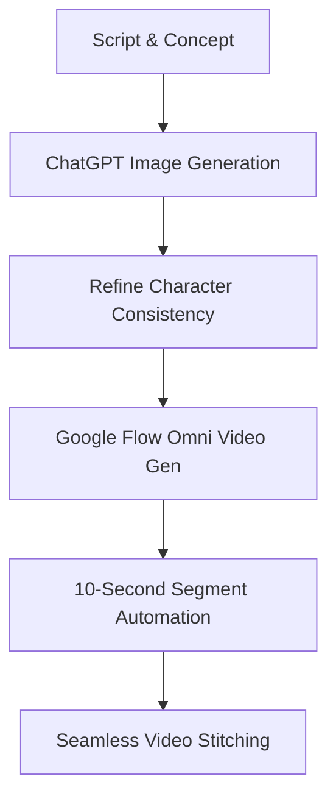

Creating highly realistic AI influencer presenters for long-form YouTube content involves two major steps: generating a perfectly consistent character base image using **ChatGPT** (or Midjourney), and using **Google Flow Omni** to bring that character to life through video generation. 

By utilizing Google Flow Omni's advanced continuous rendering, you can create a performance that feels like a real YouTube creator speaking directly to their audience.

## The AI Presenter Workflow



## Step 1: Generating the Base Character Image in ChatGPT

To get the most realistic video output in Google Flow Omni, you need a high-quality, photorealistic source image. The prompt below is designed to eliminate "AI smoothness" and generate a cinematic, lifelike presenter.

### The Master Image Generation Prompt

```text
Photorealistic cinematic lifestyle portrait of a young adult woman sitting upright on a comfortable beige fabric sofa in a sophisticated cozy living room. She has long, naturally wavy dark brown to black hair, center-parted, subtle natural makeup, defined eyebrows, warm brown eyes, and a friendly confident expression while looking directly into the camera as if speaking to the viewer. She wears a fitted deep burgundy long-sleeve wrap-style top and loose cream-colored trousers.

Her posture is relaxed and professional, sitting centered on the sofa with her hands naturally clasped together in front of her. Natural realistic hands and anatomy, relaxed fingers.

Environment: elegant modern living room with warm neutral beige and brown tones, large cream sofa, textured olive-gray and beige cushions, soft knitted throw blanket on the right side, minimalist wooden shelving unit in the background with books, decorative ceramics, small plants and warm table lamps. A large indoor plant and framed minimalist artwork are visible in the background. A small coffee table is partially visible in the foreground with subtle decor.

Lighting: warm cinematic indoor lighting, soft diffused key light illuminating her face, gentle warm practical lights in the background, subtle shadows, realistic skin tones, natural highlights, cozy evening atmosphere, soft depth and dimensionality.

Composition: medium-wide talking-head shot, camera positioned at approximately eye level, woman centered in frame, symmetrical composition, enough space around her body and environment, camera approximately 2–3 meters away. Show from approximately the waist/thighs upward while keeping the sofa and living-room environment visible.

Camera: professional full-frame camera, 50mm lens, shallow but controlled depth of field, sharp focus on eyes and face, softly blurred background, realistic optical bokeh, natural perspective, high dynamic range.

Visual style: premium cinematic lifestyle photography, extremely photorealistic, realistic skin texture, realistic hair strands, physically accurate fabric textures, subtle imperfections, natural facial proportions, soft filmic contrast, warm neutral color grading, no exaggerated beauty retouching.

Aspect ratio: 16:9 horizontal, high resolution.

Avoid: CGI appearance, plastic skin, excessive makeup, over-sharpening, distorted hands, extra fingers, unnatural facial features, artificial-looking hair, extreme bokeh, oversaturated colors, text, logos, watermark.
```

> [!TIP]
> **Why this prompt works:** It specifies exact camera angles (50mm lens, eye-level), lighting (warm practical lights), and explicitly commands the AI to avoid plastic skin textures.

## Step 2: Generating the Long-Form Video with Google Flow Omni

Once you have your generated base image, feed it into Google Flow Omni along with your script. Google Flow automatically manages 10-second contextual generation blocks to maintain spatial consistency.

### The Master Video Generation Prompt

```text
Create a natural, engaging long-form YouTube presenter performance using the selected character.

I will provide the complete script below.

Speak the script exactly as written. Do not rewrite, paraphrase, add, remove, repeat, or reorder any dialogue.

Since each generation is approximately 10 seconds, automatically divide the script into natural consecutive segments. Split at sentence endings, pauses, or natural changes of thought while keeping every word in the correct order.

The presenter should actively perform the dialogue rather than simply read it.

Use natural facial expressions, expressive eyes, subtle head movement, and realistic hand gestures that match what she is saying. She should naturally move both hands while explaining ideas, occasionally gesture for emphasis, smile when appropriate, and change her expression according to the emotion of the dialogue.

Keep the performance energetic, confident, warm and conversational, like a real YouTube creator speaking directly to the audience.

Use natural camera variation between clips:
front-facing shots for important statements and direct communication, occasional left/right three-quarter angles while explaining, and occasional wider shots when hand gestures are important.

Camera changes should happen at natural pauses or sentence transitions, not randomly in the middle of a thought.

Maintain the exact same character, voice, clothing, environment, lighting and visual identity across every clip.

Make all generated clips feel like one continuous professional recording rather than separate AI generations.

SCRIPT:

[PASTE SCRIPT HERE]
```

## Key Takeaways
1. **Image Quality Determines Video Quality**: Google Flow Omni inherits the textural detail of your source image.
2. **Explicit Emotional Direction**: Command the video model to use specific expressions (e.g., "warm and conversational").
3. **Automated Segmentation**: Flow Omni handles the 10-second chunking automatically when provided with the correct structural prompt.
