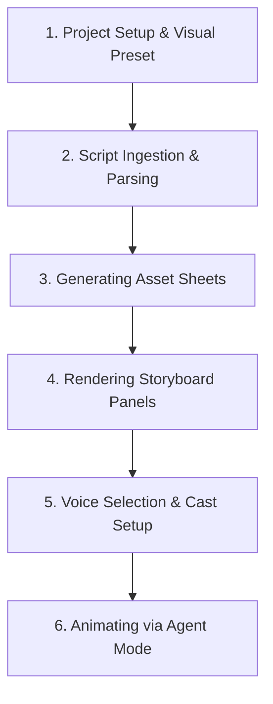

Generating a consistent AI video has historically required jumping between multiple independent image generators, editing software, and writing assistants. Google Flow's new **Storyboard Studio** resolves this by consolidating script parsing, asset tracking, and rendering into a single workflow.

In this tutorial, we walk through the step-by-step process of creating a complete AI-animated sequence, starting from raw script ingestion to final animated output.

---

## The Filmmaking Sequence

Below is the step-by-step path you will follow in this tutorial:



---

## Step 1: Project Setup & Visual Preset

First, launch Google Flow and create a new project. From the left sidebar, open the **Tools Panel** and select **Storyboard Studio**.

Before importing your script, you must choose a visual style preset. This locks the aesthetic across all generated frames:
- **3D Animation Preset (Recommended)**: Ideal for cartoon or modern digital designs.
- **Photorealistic Preset**: Best for cinematic, high-contrast imagery.
- **Sketch Art / Mockup Preset**: Great for raw drafting and planning.

Select **3D Animation** and click **Get Started**.

---

## Step 2: Script Ingestion & Parsing

Navigate to the **Script Tab** and paste your script. Storyboard Studio's parsing engine automatically structures the text into individual scene blocks:

```markdown
[SCENE 1] - INT. LABORATORY - DAY
SOPHIA (adjusting a holographic interface card):
"The system parameters are fully initialized."
```

Review the parsed layout to ensure dialogues are linked to the correct characters and actions are separated correctly. If necessary, you can edit the text blocks directly within the parser workspace.

---

## Step 3: Generating Asset Sheets

Switch to the **Assets Tab**. Instead of manual prompt writing, click the automation buttons to extract scene components:
1. **Autofill Characters**: Reads character descriptions (like Sophia) and creates multi-angle face reference sheets.
2. **Autofill Locations**: Generates the laboratory background environments.
3. **Autofill Props**: Renders specific items mentioned (such as holographic cards).

If an asset does not match your vision, click **Regenerate** or adjust the description tag to tweak it before proceeding.

---

## Step 4: Rendering Storyboard Panels

Navigate to the **Storyboard Tab**. Your timeline will display empty frames corresponding to your script scenes. 

Click **Autofill Scene**. The engine uses your generated character sheets, locations, and props to render consistent, detailed illustrations for each scene block.

---

## Step 5: Voice Selection & Cast Setup

Open the **Characters Panel** to assign voice profiles:
1. Select a character card.
2. Click **Voice Selection**.
3. Audition the available voice styles and select the profile that best matches the character's personality.
4. Repeat this setup for every member of the cast.

---

## Step 6: Animating via Agent Mode

With frames and voices configured, you can generate the final animations:
1. Open the media library and select a storyboard frame.
2. Click **Add to Prompt**.
3. Select **Agent Mode**.
4. Copy the matching script description and paste it into the prompt box.
5. Add the active character tag (e.g. `[Sophia]`).
6. Click **Generate**.

```markdown
// Prompt constructed by Agent Mode
"Camera zooms in slowly. [Sophia] speaking, lips synced to audio: 'The system parameters are fully initialized.' 3D animation style, soft lighting, laboratory background."
```

Within a few moments, the static frame is converted into a talking animation with synchronized dialogue. Repeat this step for each panel on your timeline to compile your video.

---

## Editorial Image Asset Checklist

### 1. Hero Image
- **Prompt**: Minimalist, clean 3D render of storyboard frames transitioning into animated panels with voice-over nodes. Sky blue and purple gradients, lots of white space, daylight look.
- **Filename**: `/images/tutorials/google-flow-filmmaking-hero.png`
- **Alt Text**: Storyboard frames transitioning into video rendering panels.
- **Caption**: Figure 1: Building a sequential animation workflow.
- **Placement**: Directly below the frontmatter title.
- **Purpose**: Visually represents the script-to-video workflow.
- **Aspect Ratio**: 16:9

### 2. Supporting Visual 1
- **Prompt**: Modern UI layout showing character voice selection sliders and play buttons on a white background with soft shadows.
- **Filename**: `/images/tutorials/voice-selection-sliders.png`
- **Alt Text**: Character voice preview and configuration cards in Google Flow.
- **Caption**: Figure 2: Setting up character voice profiles.
- **Placement**: Under the "Voice Selection & Cast Setup" section.
- **Purpose**: Illustrates the voice configuration steps.
- **Aspect Ratio**: 16:9

### 3. Supporting Visual 2
- **Prompt**: Split visual showing a prompt text box on the left transforming into an animation timeline node on the right. Soft sky-blue highlight lighting.
- **Filename**: `/images/tutorials/prompt-to-timeline.png`
- **Alt Text**: Process showing prompt text input transforming into a timeline block.
- **Caption**: Figure 3: Compiling prompts into timeline frames.
- **Placement**: Under the "Animating via Agent Mode" section.
- **Purpose**: Visualizes the prompt compilation process.
- **Aspect Ratio**: 16:9

---

## Key Takeaways
- **Preset Selection**: Choose your visual style preset early to lock in styling across all frames.
- **Asset Linking**: Generate character, location, and prop profiles to ensure design consistency.
- **Manual Project Saving**: Remember to save manually, as Storyboard Studio does not auto-save.
- **Agent-Assisted Prompting**: Use Agent Mode and character tags to simplify generating synchronized, talking animations.

---

## Internal Linking Opportunities
- Watch the video walk-through in our [Google Flow Storyboard Studio video guide](file:///c:/Users/jasva/Nadhebe/src/content/youtube-articles/google-flow-storyboard-studio-tutorial.md).
- Review the core dashboard features in the [Google Flow Storyboard Studio feature analysis](file:///c:/Users/jasva/Nadhebe/src/content/tools/google-flow-storyboard-studio-pre-production.md).
- Learn how developers route general model tasks in [Multi-Model Gateways Guide](file:///c:/Users/jasva/Nadhebe/src/content/guides/multi-model-orchestration-api-gateways.md).
