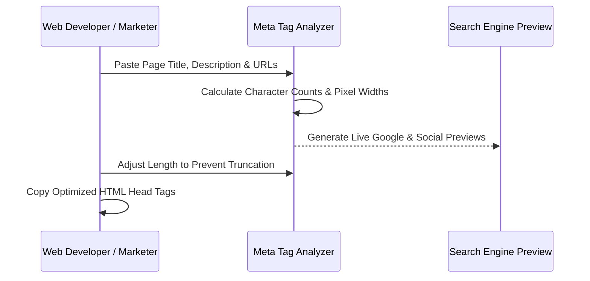

# How to Analyze Meta Tags for SEO: Step-by-Step Tutorial

Auditing HTML metadata is a fundamental technical SEO task. Properly structured meta tags provide search engine crawlers and social media platforms with clear signals about your content's topic, primary keywords, and visual representation.

In this tutorial, we will walk through a step-by-step audit process using our interactive [Meta Tag Analyzer](/tools/meta-tag-analyzer/) to inspect title length, meta description character counts, canonical tags, and OpenGraph previews.

---

## Key Takeaways

- **Character Count Discipline**: Keep title tags between 50–60 characters and descriptions between 140–160 characters.
- **Canonical Consistency**: Always verify that `rel="canonical"` matches the exact protocol (`https://`) and URL path.
- **Social Card Verification**: Test `og:image` resolution (1200×630 px) to prevent blurry thumbnail rendering on X and LinkedIn.
- **Automated Validation**: Use client-side tooling to eliminate syntax errors like unclosed quote marks or missing tags.

---

## Step-by-Step Audit Workflow



---

## Step 1: Audit Title Tag Length & Keyword Placement

Open the [Meta Tag Analyzer](/tools/meta-tag-analyzer/) and input your page title.
1. Check the real-time character counter. Aim for **50 to 60 characters**.
2. Verify that your primary target keyword is positioned in the first 3–5 words.
3. Ensure the brand name is placed at the end using a clean separator such as `|` or `–`.

---

## Step 2: Validate Meta Description Appeal & Length

Input your page meta description into the analyzer.
1. Verify character count stays within **140 to 160 characters**.
2. Ensure the description contains a compelling call to action (e.g. *"Learn how to...", "Discover step-by-step..."*).
3. Avoid generic filler text; make every word informative.

---

## Step 3: Inspect OpenGraph & Twitter Card Tags

Rich social media previews increase social engagement and referral traffic.
1. Specify `og:image` with a high-contrast 1200×630 px image URL.
2. Confirm `twitter:card` is set to `summary_large_image` for full-width card rendering.
3. Test your domain preview inside our live [Meta Tag Analyzer](/tools/meta-tag-analyzer/) social card preview box.

---

## Step 4: Copy Generated HTML Tags to Your Project

Once all parameters pass validation:
1. Click **Copy HTML** in the code output panel.
2. Paste the generated meta block directly inside your template's `<head>` element.

```html
<title>How to Analyze Meta Tags for SEO: Step-by-Step Tutorial | Nadhebe</title>
<meta name="description" content="Learn how to systematically audit HTML title tags, meta descriptions, and OpenGraph social cards." />
<link rel="canonical" href="https://nadhebe.com/tutorials/how-to-analyze-meta-tags-for-seo/" />

<!-- OpenGraph Social Tags -->
<meta property="og:type" content="article" />
<meta property="og:title" content="How to Analyze Meta Tags for SEO: Step-by-Step Tutorial" />
<meta property="og:description" content="Learn how to systematically audit HTML title tags and OpenGraph cards." />
<meta property="og:url" content="https://nadhebe.com/tutorials/how-to-analyze-meta-tags-for-seo/" />
<meta property="og:image" content="https://nadhebe.com/images/how-to-analyze-meta-tags-hero.webp" />
```

---

## Frequently Asked Questions

### Why does Google rewrite my meta description?
If Google determines that your meta description does not directly address the user's specific search query, its search algorithms will automatically generate a dynamic snippet from page text.

### Can I test draft pages that are not live yet?
Yes. Our client-side [Meta Tag Analyzer](/tools/meta-tag-analyzer/) allows you to input raw text and preview titles, descriptions, and OpenGraph cards locally before deploying code.

---

## References

1. Google Search Central — *Create good titles and snippets in search results*: https://developers.google.com/search/docs/appearance/snippet
2. W3C HTML5 Specification — *The meta element*: https://www.w3.org/TR/html52/document-metadata.html#the-meta-element
