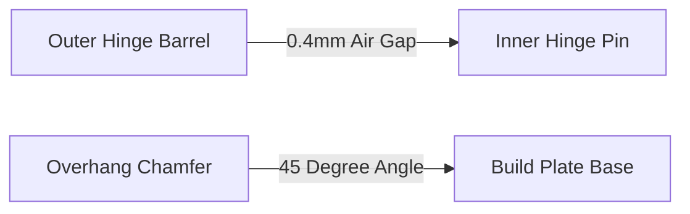

With its advanced understanding of physical space, mechanical tolerances, and math, **Kimi K3** is highly capable of generating precise OpenSCAD scripts. 

In this tutorial, you will learn how to write a structured script prompt that instructs Kimi K3 to generate a **support-free, interlocking mechanical hinge assembly** that can be 3D printed directly in a single run.

---

## Technical Concept: Support-Free Hinge

A print-in-place hinge requires two things to print successfully without merging:
1. **Vertical Clearance**: An exact gap (air tolerance) between the rotating pin and the hinge barrel.
2. **Support-Free Angle**: Any horizontal overhang must not exceed 45 degrees, or the printer filament will sag.



---

## Step 1: Formulate the Structured Prompt Spec

To instruct Kimi K3, we apply our **4-Pillar Prompt Framework**:

```markdown
Role: Expert CAD Engineer & OpenSCAD Specialist

Write an OpenSCAD (.scad) script for a print-in-place interlocking mechanical hinge.

1. SETTING & FUNCTION:
   - Create a dual-plate hinge that pivots smoothly.
   - Design chamfered edges to ensure no part needs supports.

2. CORE MECHANICS:
   - Outer Barrel diameter: 10mm
   - Inner Pin diameter: 6mm
   - Hinge width: 30mm
   - Clearance (Air Gap): Exactly 0.4mm between pin and barrel to prevent fusion during printing.

3. TECHNICAL CONSTRAINTS:
   - Output ONLY clean, executable OpenSCAD script code.
   - Use standard parameter names at the top of the file so dimensions can be easily adjusted.
   - Use smooth resolution ($fn = 60).

4. FEASIBILITY:
   - Restrict all overhang angles to 45-degree chamfers.
   - The hinge must print flat on the build plate.
```

---

## Step 2: Ingest the Output in OpenSCAD

Copy the OpenSCAD script generated by Kimi K3. The model should output code similar to the following clean geometry block:

```openscad
// Interlocking Hinge Specs
$fn = 60;
clearance = 0.4;
pin_r = 3.0;
barrel_r = 5.0;
hinge_w = 30;

module hinge_pin() {
    // Rotating pin inside the assembly
    cylinder(h=hinge_w, r=pin_r - (clearance/2), center=true);
}

module hinge_barrel() {
    // Outer barrel with clearance gap
    difference() {
        cylinder(h=hinge_w/2, r=barrel_r, center=true);
        cylinder(h=hinge_w + 2, r=pin_r + (clearance/2), center=true);
    }
}
```

Paste this code into the OpenSCAD editor. Render the model by pressing **F6**, and export it as an STL file for slicing.

---

## Step 3: Slice and Print

Open the STL file in your preferred slicer (e.g., PrusaSlicer, Cura):
1. **Layer Height**: Set to `0.2mm` for standard resolution.
2. **Support Material**: Ensure supports are **disabled**. The 45-degree chamfers allow the printer to bridge the overhangs safely.
3. **Infill**: Set to `20%` gyroid infill for structural strength.

Once the print finishes, gently twist the hinge plates to break the minor connection nodes. Thanks to Kimi K3's precise `0.4mm` tolerance calculation, the hinge will snap loose and pivot smoothly.

---

## Image Asset Specifications

* **Hero Image**:
  - **Prompt**: "Minimal 3D editorial rendering showing a clean support-free interlocking hinge model, soft shadows, pristine white background."
  - **Filename**: "kimi-k3-hinge-tutorial-hero.png"
  - **Alt text**: "3D model render of interlocking mechanical hinge"
  - **Caption**: "Generating print-in-place mechanical assemblies with zero support structures."
  - **Placement**: Top of page
  - **Purpose**: Hero header asset
  - **Aspect ratio**: 16:9
* **Supporting Visual 1**:
  - **Prompt**: "Technical CAD engineering line-art showing pin and barrel clearances, blue design layout, vector icons."
  - **Filename**: "hinge-clearance-dimensions.png"
  - **Alt text**: "CAD line-art dimensions for hinge pin and barrel clearances"
  - **Caption**: "Ensuring adequate air gap tolerances to prevent part fusion."
  - **Placement**: Under 'Technical Concept' section
  - **Purpose**: Technical details layout
  - **Aspect ratio**: 4:3
* **Supporting Visual 2**:
  - **Prompt**: "OpenSCAD workspace interface mockup showing geometric code side-by-side with 3D model viewport, clean flat layout."
  - **Filename**: "openscad-workspace-ui.png"
  - **Alt text**: "OpenSCAD code editor interface mockup viewport"
  - **Caption**: "Validating the Kimi K3 generated script inside the OpenSCAD rendering environment."
  - **Placement**: Under 'Step 2: Ingest the Output' section
  - **Purpose**: Workspace GUI demonstration
  - **Aspect ratio**: 4:3
