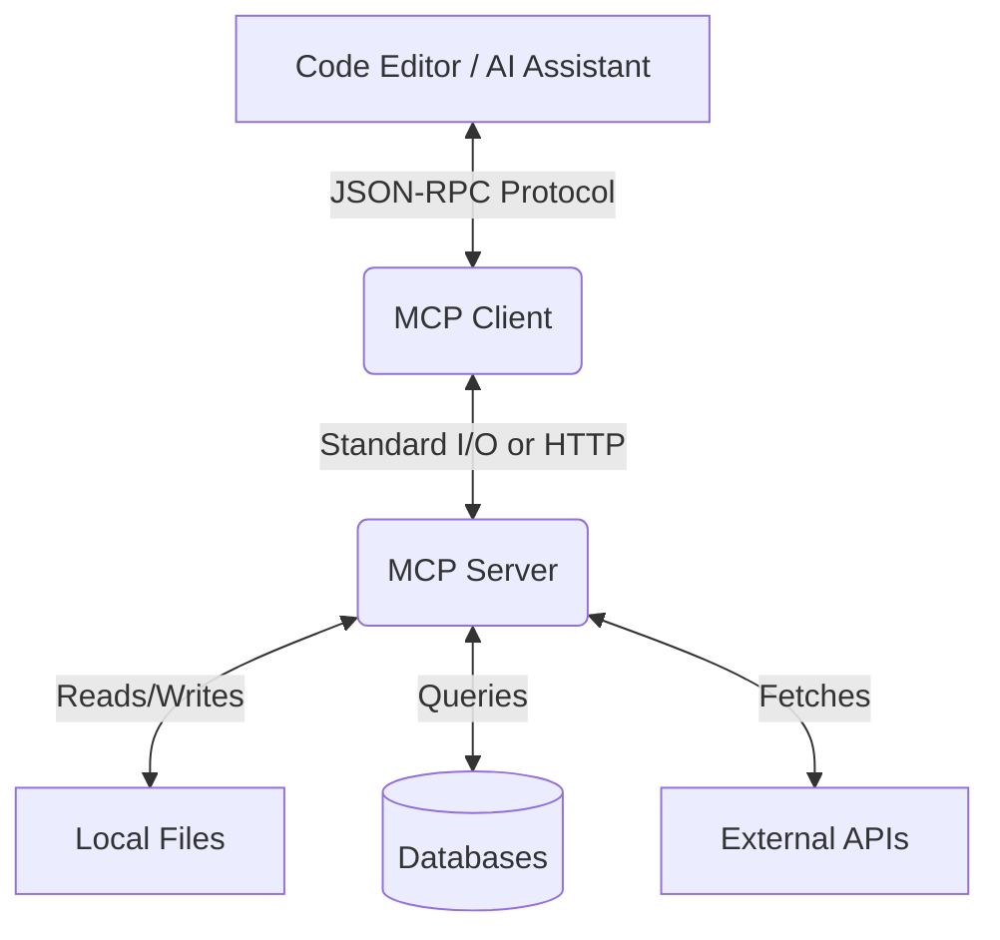

# How to Integrate MCP Server in VS Code & Cursor

The Model Context Protocol (MCP) is rapidly becoming the gold standard for connecting AI coding assistants to your local environment. If you've been using AI tools like Claude or GPT-4, you know that context is everything. Without knowing your file structure, database schema, or local API state, the AI is effectively flying blind.

By integrating an **MCP Server** directly into **VS Code** or **Cursor**, you grant these AI models secure, structured access to your workspace. This transforms them from generic chatbots into highly capable, context-aware pair programmers.

In this comprehensive tutorial, we will walk you through the entire process of setting up, configuring, and optimizing an MCP server for both VS Code and Cursor.

## What is the Model Context Protocol (MCP)?

Before diving into the integration, it's crucial to understand what MCP actually does. Open-sourced by Anthropic, the Model Context Protocol is an open standard that allows AI models to securely connect to external tools and data sources.

Think of it as a standardized API for context. Instead of copying and pasting code snippets, or manually explaining your project structure, an MCP server allows the AI to autonomously query your environment.

### The Architecture



As shown in the architecture diagram above, the MCP Client (running inside Cursor or a VS Code extension) communicates with the MCP Server. The server then acts as a secure proxy to your local resources.

## Why Integrate MCP?

1. **Eliminate Copy/Paste Fatigue**: Stop manually feeding the AI files. The AI can read the files it needs.
2. **Context-Aware Debugging**: The AI can read error logs, check git diffs, and inspect database schemas to find the root cause of a bug.
3. **Automated Workflows**: With write permissions, the AI can execute scripts, run tests, and format code autonomously.

## Prerequisites

Before we begin, ensure you have the following installed:
- Node.js (v18 or higher)
- npm or pnpm
- VS Code or Cursor editor
- (For VS Code) An AI extension that supports MCP, such as [Cline](https://github.com/cline/cline) or Roo Code.

---

## Part 1: Integrating MCP in Cursor

Cursor is a fork of VS Code built specifically for AI. It has built-in support for the Model Context Protocol, making integration incredibly straightforward.

### Step 1: Open Cursor Settings
Launch Cursor and open the settings panel (`Cmd/Ctrl` + `,`). Navigate to the **Features** tab, and scroll down to the **MCP** section.

### Step 2: Add a New MCP Server
Click on **+ Add New MCP Server**. You will be prompted to provide three pieces of information:
- **Name**: Give your server a recognizable name (e.g., `Local-FS-Server`).
- **Type**: Select `command`.
- **Command**: Enter the command to start the server. For a standard file-system server, you can use the official `@modelcontextprotocol/server-filesystem`.

Example Command:
```bash
npx -y @modelcontextprotocol/server-filesystem /path/to/your/workspace
```

> [!IMPORTANT]
> Ensure you provide the absolute path to your workspace directory. The AI will only have access to the directories you explicitly allow.

### Step 3: Validate and Connect
Once added, Cursor will attempt to start the server. You should see a green dot indicating a successful connection. If it fails, double-check that you have Node.js installed and the path is correct. 

*(Pro tip: If you run into JSON parsing errors when writing custom servers, you can validate your JSON outputs using our [JSON Validator](https://nadhebe.com/tools/json-validator/) tool).*

---

## Part 2: Integrating MCP in VS Code

Unlike Cursor, VS Code does not have native, built-in support for MCP out of the box. However, the open-source community has provided excellent extensions that act as MCP clients. For this guide, we will use **Cline**.

### Step 1: Install the Cline Extension
Open the Extensions view in VS Code (`Cmd/Ctrl` + `Shift` + `X`) and search for **Cline**. Install the extension.

### Step 2: Configure the MCP Settings File
Cline uses a configuration file to manage MCP servers. Click on the MCP icon in the Cline sidebar panel to open the `cline_mcp_settings.json` file.

Add your server configuration under the `mcpServers` object:

```json
{
  "mcpServers": {
    "local-filesystem": {
      "command": "npx",
      "args": [
        "-y",
        "@modelcontextprotocol/server-filesystem",
        "/Users/username/Projects/my-app"
      ]
    },
    "github-server": {
      "command": "npx",
      "args": [
        "-y",
        "@modelcontextprotocol/server-github"
      ],
      "env": {
        "GITHUB_PERSONAL_ACCESS_TOKEN": "your_token_here"
      }
    }
  }
}
```

### Step 3: Restart and Verify
Save the file. Cline will automatically detect the changes and initialize the servers. You can click on the 'tools' icon in the Cline interface to see the available tools exposed by your new MCP servers (e.g., `read_file`, `list_directory`, `search_files`).

## Best Practices and Security Considerations

When giving an AI access to your local machine, security is paramount.

> [!CAUTION]
> Never grant an MCP server access to your root directory (`/` on Mac/Linux or `C:\` on Windows). Always scope the access strictly to your current project workspace.

### Checklist for Secure Deployment:
- [x] Use absolute paths scoped to the project directory.
- [x] Use environment variables for API keys; never hardcode them in your configuration files.
- [x] Review the source code of third-party MCP servers before running them via `npx`.
- [x] Monitor the AI's tool usage in your editor's logs.

## Troubleshooting Common Errors

### "Connection Refused"
If your editor cannot connect to the MCP server, ensure that no background processes are blocking the execution of `npx`. On Windows, you may need to adjust your Execution Policy.

### "Tool Not Found"
If the AI tries to use a tool that doesn't exist, verify that the server successfully started and that the specific tool is exposed by the server. You can usually check the MCP logs in both Cursor and VS Code to see exactly which tools were successfully registered.

## Conclusion

Integrating the Model Context Protocol into VS Code and Cursor completely changes the way you interact with AI coding assistants. By bridging the gap between the AI model and your local environment, you enable workflows that were previously impossible.

Whether you're using Cursor's native integration or VS Code with Cline, the setup takes only a few minutes but provides compounding returns in productivity. Start with a simple filesystem server, and soon you'll be connecting databases, cloud infrastructure, and custom APIs directly to your AI workflows.
