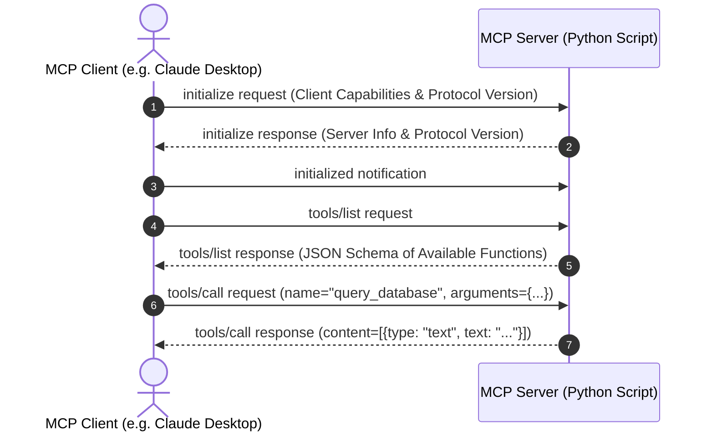

# Model Context Protocol (MCP) Architecture and Production API Tutorial

Connecting large language models and autonomous developer agents to external tools, databases, and local development environments has historically required writing custom, fragmented glue code. Every AI application (such as Claude Desktop, Cursor, Windsurf, or custom LangChain agents) had its own proprietary tool-calling format.

The **Model Context Protocol (MCP)**—introduced as an open standard by Anthropic—establishes a universal, standard protocol for connecting AI clients to data sources and executable tools. Think of MCP as the **USB-C port for AI applications**.

In this architecture guide and tutorial, you will learn the core primitives of MCP, JSON-RPC 2.0 transport layers (`stdio` vs `SSE`), and how to build a production-grade MCP server in Python from scratch.

---

## MCP System Architecture & Client-Server Topology

The Model Context Protocol uses a client-server architecture where host applications act as **MCP Clients** that discover, inspect, and invoke capabilities hosted on **MCP Servers**.

```mermaid
flowchart LR
    subgraph MCP Clients (Host Applications)
        ClaudeDesk[Claude Desktop Application]
        CursorIDE[Cursor / Windsurf IDE]
        CustomAgent[Custom Python AI Agent]
    end
    
    subgraph MCP Transport Boundary
        StdIO[stdio Transport / Local Pipes]
        SSE[SSE Transport / HTTP Server]
    end
    
    subgraph MCP Servers (Data & Tool Providers)
        DBServer[PostgreSQL / SQLite MCP Server]
        GitHubServer[GitHub API MCP Server]
        LocalFileServer[Local Filesystem MCP Server]
    end
    
    ClaudeDesk --> StdIO --> DBServer
    CursorIDE --> StdIO --> LocalFileServer
    CustomAgent --> SSE --> GitHubServer
```

### The Three MCP Core Primitives

MCP standardizes three distinct capabilities that a server can expose to AI clients:

| Primitive Name | Function Description | Primary Use Case |
|---|---|---|
| **Resources** | Read-only data streams exposed via URI schemes (`file://`, `postgres://`). | Reading documentation files, database schemas, or system logs. |
| **Tools** | Executable functions exposed with JSON Schema parameter definitions. | Running SQL queries, executing shell scripts, or calling REST APIs. |
| **Prompts** | Pre-engineered prompt templates with parameter substitution slots. | Standardizing team code review workflows and bug report generation. |

---

## The JSON-RPC 2.0 Protocol Message Flow

MCP messages travel across transport channels as structured **JSON-RPC 2.0** requests and responses.



### 1. Tool Discovery Request (`tools/list`)

```json
{
  "jsonrpc": "2.0",
  "id": 1,
  "method": "tools/list"
}
```

### 2. Server Response Payload

```json
{
  "jsonrpc": "2.0",
  "id": 1,
  "result": {
    "tools": [
      {
        "name": "calculate_vram_allocation",
        "description": "Calculates local GPU VRAM memory requirements for a model size and context length.",
        "inputSchema": {
          "type": "object",
          "properties": {
            "param_count_billions": { "type": "number" },
            "quantization": { "type": "string", "enum": ["FP16", "Q8_0", "Q4_K_M"] },
            "context_length": { "type": "integer" }
          },
          "required": ["param_count_billions", "quantization"]
        }
      }
    ]
  }
}
```

---

## Step-by-Step Production MCP Server Implementation in Python

We will build a production-grade Python MCP server using the official FastMCP SDK (`mcp`).

### Step 1: Environment Setup & Package Installation

Install the official Model Context Protocol Python SDK:

```bash
pip install mcp pydantic uv
```

### Step 2: Writing the Python MCP Server (`server.py`)

Create a script that exposes GPU calculation tools and system resources:

```python
import sys
from mcp.server.fastmcp import FastMCP, Context

# 1. Initialize FastMCP server instance
mcp = FastMCP("Nadhebe-GPU-Infrastructure-Server")

# --- PRIMITIVE 1: TOOL DEFINITION ---
@mcp.tool()
def calculate_vram_overhead(
    param_count_billions: float,
    quantization: str = "Q4_K_M",
    context_length: int = 4096
) -> str:
    """
    Calculates estimated GPU VRAM allocation in Gigabytes for a local model.
    """
    quant_bits = {
        "FP16": 16.0,
        "Q8_0": 8.0,
        "Q4_K_M": 4.5,
        "Q2_K": 2.5
    }.get(quantization, 4.5)
    
    # Weight memory overhead
    weight_memory_gb = (param_count_billions * quant_bits / 8.0) * 1.2
    
    # Estimated KV cache memory for given context length (GB)
    kv_cache_gb = (2 * 32 * 32 * 128 * context_length) / 1e9
    
    total_vram = round(weight_memory_gb + kv_cache_gb, 2)
    
    return (
        f"VRAM Memory Calculation Breakdown:\n"
        f"- Model Parameters: {param_count_billions}B\n"
        f"- Quantization Precision: {quantization} ({quant_bits} bits/weight)\n"
        f"- Weight Baseline Footprint: {round(weight_memory_gb, 2)} GB\n"
        f"- Context Memory ({context_length} tokens): {round(kv_cache_gb, 2)} GB\n"
        f"- Total VRAM Headroom Required: {total_vram} GB"
    )

# --- PRIMITIVE 2: RESOURCE DEFINITION ---
@mcp.resource("system://gpu-hardware-matrix")
def get_gpu_hardware_matrix() -> str:
    """Returns static lookup matrix for enterprise GPU VRAM caps."""
    return """
    NVIDIA GPU Hardware Memory Matrix:
    - RTX 4060: 8 GB GDDR6 (272 GB/s)
    - RTX 4070 Ti: 12 GB GDDR6X (504 GB/s)
    - RTX 4090: 24 GB GDDR6X (1008 GB/s)
    - NVIDIA A100: 80 GB HBM2e (1935 GB/s)
    - NVIDIA H100: 80 GB HBM3 (3350 GB/s)
    """

# --- PRIMITIVE 3: PROMPT TEMPLATE DEFINITION ---
@mcp.prompt()
def audit_gpu_deployment_prompt(gpu_model: str, model_name: str) -> str:
    """Generates a standardized prompt for auditing GPU server deployments."""
    return f"""Please audit the deployment of {model_name} on an {gpu_model} GPU.
1. Use the 'calculate_vram_overhead' tool to check memory safety.
2. Read resource 'system://gpu-hardware-matrix' to verify memory bandwidth capabilities.
3. Provide deployment recommendations."""

# 3. Launch stdio server execution
if __name__ == "__main__":
    mcp.run(transport="stdio")
```

---

## Integrating with Claude Desktop and Cursor

To connect your custom MCP server to **Claude Desktop**, edit `claude_desktop_config.json`:

```json
{
  "mcpServers": {
    "nadhebe-gpu-server": {
      "command": "python",
      "args": [
        "C:\\Users\\jasva\\Nadhebe\\scripts\\server.py"
      ]
    }
  }
}
```

Upon launching Claude Desktop, the application automatically executes `tools/list`, discovers `calculate_vram_overhead`, and renders a hammer icon enabling the AI model to call your Python script natively during chat conversations.

---

## Summary & Key Takeaways

- **Universal Standard**: MCP eliminates custom glue code by providing a single protocol for AI tools and resources.
- **Transports**: Use `stdio` for zero-latency local CLI and desktop tools, and `SSE` for web microservices.
- **FastMCP**: Anthropic's Python FastMCP SDK turns standard Python functions into production MCP tools with simple `@mcp.tool()` decorators.
