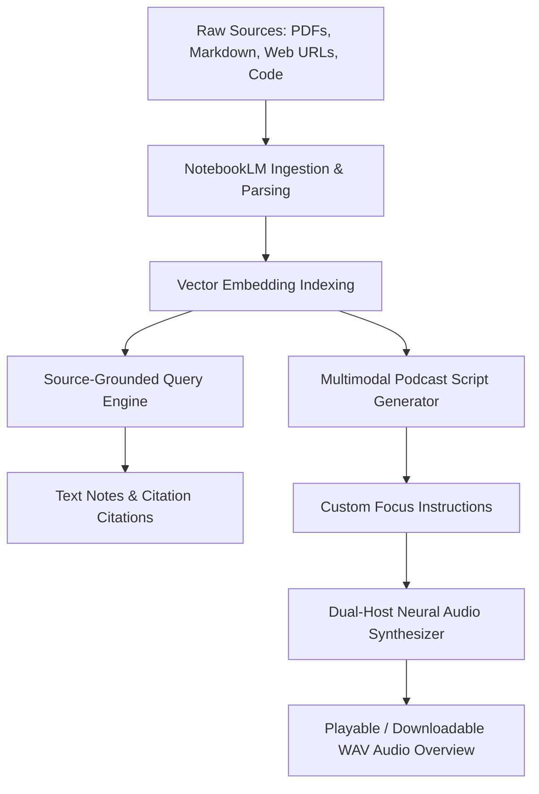

Google's **NotebookLM** has evolved from a document assistant into a powerful **Source-Grounded Retrieval-Augmented Generation (RAG) platform**. Its flagship feature—**Audio Overviews**—uses fine-tuned multimodal speech models to convert raw documentation, whitepapers, codebases, and YouTube transcripts into dynamic two-host podcast discussions.

In this step-by-step tutorial, you will learn how to structure complex technical sources, direct Audio Overview discussions, and leverage NotebookLM for developer research workflows.

---

## Key Takeaways

> [!TIP]
> - **Zero-Hallucination Grounding**: Unlike general LLMs, NotebookLM anchors responses strictly to uploaded sources, providing inline citation numbers linking back to exact page numbers or paragraphs.
> - **Steerable Audio Synthesizer**: Custom instructions allow shaping the tone, depth, and specific technical focus of the AI co-host podcast.
> - **Multi-Source Knowledge Matrix**: Combines up to 50 disparate sources (PDFs, Markdown, YouTube URLs, Slides) into a unified cross-referenced knowledge graph.
> - **Developer RAG Alternative**: Ideal for fast exploratory domain analysis before spending time building custom vector databases.

---

## Workflow: NotebookLM Source Processing Pipeline

The following diagram illustrates how NotebookLM ingests documents, indexes embeddings, and generates both grounded text notes and interactive Audio Overviews:



---

## Step 1: Curating & Pre-processing Technical Sources

To get the highest accuracy out of NotebookLM's source-grounded RAG engine, follow these formatting guidelines before importing:

1. **Clean Markdown & Header Hierarchies**: Ensure PDFs or text documents have clear `# H1` and `## H2` structure.
2. **Include Code Explanations**: NotebookLM processes plain text best. Annotate raw code snippets with explicit docstrings explaining architectural intent.
3. **URL & YouTube Aggregation**: Pass direct technical documentation links or recorded tech talk YouTube URLs.

```bash
# Example structure for a NotebookLM source bundle:
./knowledge-bundle/
├── 01-architecture-overview.md
├── 02-api-specifications.pdf
├── 03-benchmark-results.csv
└── 04-deployment-runbook.md
```

---

## Step 2: Customizing Audio Overviews with Steerable Prompts

When generating an Audio Overview, default settings create a generalized overview. Use **Customize Prompts** to focus the discussion on technical nuances, API tradeoffs, or migration guides.

### Developer Prompt Blueprints

#### 1. Technical Deep-Dive Prompt
```text
Focus exclusively on the system trade-offs, database query bottlenecks, and microservice integration steps detailed in Source 01 and Source 03. Target a Senior Cloud Architect audience. Debate the pros and cons of event-driven messaging versus HTTP polling.
```

#### 2. Onboarding & Migration Focus
```text
Explain the migration path from legacy REST APIs to gRPC endpoints. Frame the conversation as a senior engineer mentoring a new developer, highlighting common pitfalls and security verification steps.
```

---

## Step 3: Querying the Notebook & Exporting Citations

Once sources are indexed, test source grounding using complex structured queries:

```text
Query: "Compare the throughput latency of vector indexing in Source 02 against the memory footprint in Source 04. Format as a markdown comparison table with citations."
```

NotebookLM will return a clean comparison table, appending interactive **[1]**, **[2]** citation tags that open the exact source paragraph in the side panel.

---

## Source Grounding vs. Custom RAG Pipelines

| Metric | NotebookLM | Custom LangChain / LlamaIndex |
| :--- | :--- | :--- |
| **Setup Time** | Instant (No-code UI) | 4-16 Hours (Python / Vector DB) |
| **Audio Overview Generation** | Native 1-Click Dual Host | Requires ElevenLabs / OpenAI Audio API |
| **Citation Precision** | Exact Paragraph & Page Links | Requires custom metadata indexing |
| **Custom Vector DB Export** | Limited | Full Control |

---

## Frequently Asked Questions

### How does NotebookLM ensure zero hallucination across uploaded PDF sources?
NotebookLM uses a source-grounded RAG architecture where model generation logits are strict conditional probabilities bounded exclusively by the indexed vector embeddings of the user's uploaded sources.

### Can developers customize the host personalities and focus topics in NotebookLM Audio Overviews?
Yes. Using the Customize Audio Overview prompt setting, developers can instruct the AI hosts to focus on specific technical sections, adopt a debate or Q&A format, or target a technical developer audience.

### What source formats are supported in NotebookLM?
NotebookLM supports Google Docs, PDFs, Google Slides, web URLs, YouTube video transcripts, copy-pasted text blocks, and Markdown files.

---

## Related Articles

- [Google AI Studio System Prompts & Structured Outputs Guide](/guides/google-ai-studio-system-prompts-structured-output-guide)
- [Gemini 3.6 Flash Complete Developer Guide](/guides/gemini-3-6-flash-complete-guide)
- [Generative Engine Optimization (GEO) Strategy Guide](/guides/generative-engine-optimization-geo-guide)
