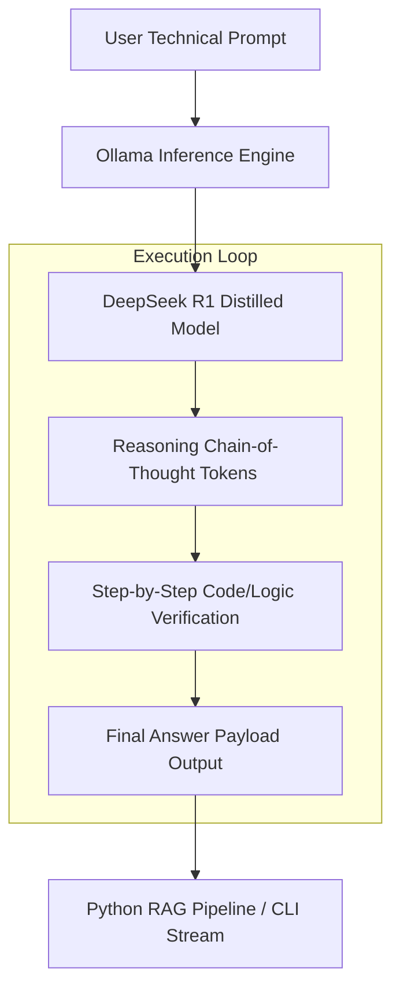

# How to Run DeepSeek R1 Locally with Ollama: Complete Guide

Running frontier reasoning models locally gives AI engineers complete data privacy, zero API latency overhead, and immunity to third-party API rate limits. **DeepSeek R1** represents a fundamental breakthrough in open-weights reasoning capabilities, delivering performance competitive with proprietary models like OpenAI o1 across mathematical synthesis, logic, and code generation.

In this developer guide, you will learn how to deploy DeepSeek R1 locally using **Ollama**, evaluate VRAM requirements using mathematical memory formulas, compare GGUF quantization trade-offs, and integrate local R1 reasoning models into Python pipelines using ChromaDB.

---

## Technical Overview & Model Architecture

DeepSeek R1 utilizes a Mixture-of-Experts (MoE) architecture alongside specialized reinforcement learning (RL) training without initial supervised fine-tuning (SFT) phase dependencies. The primary model consists of 671 billion total parameters, with 37 billion parameters active per token during inference via Multi-Head Latent Attention (MLA).

To enable consumer GPU execution, the DeepSeek team distilled R1 reasoning patterns into dense architecture models based on Qwen 2.5 and Llama 3.3 bases ranging from **1.5B to 70B parameters**.



### DeepSeek R1 Distilled Model Variants

| Model Variant | Base Architecture | Active Parameters | Context Window | Recommended Quantization |
|---|---|---|---|---|
| `deepseek-r1:1.5b` | Qwen 2.5 1.5B | 1.5B | 128,000 | `Q4_K_M` |
| `deepseek-r1:7b` | Qwen 2.5 7B | 7.0B | 128,000 | `Q4_K_M` |
| `deepseek-r1:8b` | Llama 3.1 8B | 8.0B | 128,000 | `Q4_K_M` |
| `deepseek-r1:14b` | Qwen 2.5 14B | 14.7B | 128,000 | `Q4_K_M` |
| `deepseek-r1:32b` | Qwen 2.5 32B | 32.5B | 128,000 | `Q4_K_M` |
| `deepseek-r1:70b` | Llama 3.3 70B | 70.6B | 128,000 | `Q4_K_M` |

---

## Hardware Requirements & VRAM Allocation Math

Before pulling models via Ollama, compute your system's VRAM headroom. VRAM consumption for quantized local model serving is determined by three variables: parameter weight overhead, KV cache sequence memory, and activation buffer space.

### Local GPU Memory Allocation Formula

The exact mathematical estimation of VRAM requirements ($M_{\text{VRAM}}$) in Gigabytes is:

$$M_{\text{VRAM}} = \left( \frac{P \times B_{\text{quant}}}{8} \times 1.2 \right) + \left( \frac{2 \times L \times H \times D \times B \times C}{10^9} \right)$$

Where:
- $P$ is the parameter count in billions.
- $B_{\text{quant}}$ is the quantization bits per weight (e.g., 4.5 bits for `Q4_K_M`, 8.0 for `Q8_0`, 16.0 for `FP16`).
- $1.2$ accounts for a 20% baseline memory overhead for CUDA context buffers.
- $L$ is layer depth, $H$ attention head count, $D$ dimension per head.
- $B$ is batch size (typically 1 for local desktop execution).
- $C$ is current sequence context length in tokens.

### VRAM Hardware Compatibility Matrix

| Hardware Setup | Max VRAM | Target DeepSeek R1 Model | Expected Throughput |
|---|---|---|---|
| GTX 1660 / RTX 3050 | 6 GB | `deepseek-r1:1.5b` or `deepseek-r1:7b` | ~45 tok/sec |
| RTX 4060 / RTX 3070 | 8 GB | `deepseek-r1:8b` (Q4_K_M) | ~38 tok/sec |
| RTX 4070 Ti / 3080 Ti | 12 GB | `deepseek-r1:14b` (Q4_K_M) | ~29 tok/sec |
| RTX 4090 / RTX 3090 | 24 GB | `deepseek-r1:32b` (Q4_K_M) | ~22 tok/sec |
| Apple Mac Studio M2 Ultra | 64 GB / 192 GB | `deepseek-r1:70b` (Q4_K_M) | ~14 tok/sec |

---

## Step-by-Step Installation and Setup

### Step 1: Install Ollama Engine

Install the latest Ollama runtime binary matching your operating system:

```bash
# macOS & Linux installation script
curl -fsSL https://ollama.com/install.sh | sh

# Verify Ollama installation and CLI version
ollama --version
```

For Windows users, download the native `.exe` installer from official release channels and launch the background service.

### Step 2: Pull and Run DeepSeek R1

Select the model size tailored to your available VRAM:

```bash
# Run 8B model (Ideal for 8GB VRAM GPUs)
ollama run deepseek-r1:8b

# Run 14B model (Ideal for 12GB VRAM GPUs)
ollama run deepseek-r1:14b

# Run 32B model (Ideal for 24GB VRAM GPUs)
ollama run deepseek-r1:32b
```

Upon launching the interactive terminal session, submit a logic prompt to inspect R1's reasoning process:

```text
>>> Prove that the square root of 2 is irrational using proof by contradiction.
```

Ollama outputs the model's internal thinking process enclosed within `<think>` tags prior to writing the final payload response:

```text
<think>
1. Assume sqrt(2) is rational, meaning sqrt(2) = a/b where gcd(a,b) = 1.
2. Then 2 = a^2 / b^2 => 2 * b^2 = a^2.
3. Therefore, a^2 is even, which implies a is even (a = 2k).
4. Substitute a = 2k: 2 * b^2 = (2k)^2 = 4k^2 => b^2 = 2k^2.
5. This implies b^2 is even, so b is even.
6. Contradiction: both a and b are even, violating gcd(a,b) = 1.
</think>

Therefore, the square root of 2 must be irrational. Q.E.D.
```

---

## Building a Local RAG Pipeline in Python with ChromaDB

Integrate local DeepSeek R1 reasoning into a Python Retrieval-Augmented Generation (RAG) pipeline using `ollama` and `chromadb`.

```python
import os
import chromadb
from chromadb.utils import embedding_functions
import ollama

# 1. Initialize local persistent ChromaDB vector store
chroma_client = chromadb.PersistentClient(path="./chroma_db_r1")

# Use local sentence-transformer embeddings
default_ef = embedding_functions.DefaultEmbeddingFunction()

collection = chroma_client.get_or_create_collection(
    name="deepseek_r1_knowledge",
    embedding_function=default_ef
)

# 2. Populate collection with technical documentation snippets
documents = [
    "vLLM utilizes PagedAttention to reduce KV cache memory fragmentation by up to 96%.",
    "SGLang uses RadixAttention to share KV cache across multi-turn concurrent requests.",
    "DeepSeek R1 leverages RL training directly on base models to derive reasoning paths."
]
metadatas = [{"source": "vllm_paper"}, {"source": "sglang_paper"}, {"source": "r1_paper"}]
ids = ["doc_1", "doc_2", "doc_3"]

collection.upsert(documents=documents, metadatas=metadatas, ids=ids)

def query_rag_pipeline(user_query: str):
    # 3. Retrieve relevant context documents
    results = collection.query(
        query_texts=[user_query],
        n_results=2
    )
    
    retrieved_docs = "\n".join(results['documents'][0])
    
    # 4. Construct prompt with retrieved context
    system_prompt = (
        "You are an expert AI infrastructure engineer. Use the provided context "
        "to answer the question. Think step-by-step inside <think> tags before answering."
    )
    
    user_prompt = f"Context:\n{retrieved_docs}\n\nQuestion: {user_query}"
    
    # 5. Invoke local DeepSeek R1 model via Ollama API
    response = ollama.chat(
        model='deepseek-r1:8b',
        messages=[
            {'role': 'system', 'content': system_prompt},
            {'role': 'user', 'content': user_prompt}
        ]
    )
    
    return response['message']['content']

# Example query execution
if __name__ == "__main__":
    query = "How does vLLM optimize memory during LLM inference?"
    result = query_rag_pipeline(query)
    print("--- DeepSeek R1 RAG Output ---")
    print(result)
```

---

## GGUF Quantization Comparison: Q4_K_M vs Q8_0

Choosing the right quantization format is critical when deploying models on hardware-constrained edge servers or developer workstations.

```mermaid
graph LR
    FP16[FP16 Unquantized Base] --> Q8[Q8_0 Quantization: 99.8% Accuracy | High VRAM]
    FP16 --> Q4[Q4_K_M Quantization: 97.4% Accuracy | Balanced VRAM]
    FP16 --> Q2[Q2_K Quantization: 81.2% Accuracy | Severe Perplexity Loss]
```

### Benchmarking Quantization Formats on DeepSeek R1 14B

| Quantization Format | File Size | Perplexity Loss | VRAM (16K Context) | Token Generation Speed |
|---|---|---|---|---|
| `FP16` | 29.4 GB | 0.00 (Baseline) | 33.1 GB | 18.2 tok/sec |
| `Q8_0` | 15.6 GB | +0.02 | 18.4 GB | 24.5 tok/sec |
| `Q4_K_M` | 9.0 GB | +0.14 | 11.8 GB | 32.1 tok/sec |
| `Q3_K_S` | 7.1 GB | +0.48 | 9.6 GB | 36.4 tok/sec |
| `Q2_K` | 5.2 GB | +1.89 | 7.5 GB | 39.8 tok/sec |

> **Recommendation**: `Q4_K_M` represents the optimal balance for consumer hardware, preserving 97%+ baseline reasoning accuracy while cutting VRAM overhead by over 60%.

---

## Production Security & Best Practices

1. **Restrict Binding Interfaces**: By default, Ollama binds to `127.0.0.1:11434`. If serving over a local network, enforce reverse proxy authentication using NGINX or Caddy.
2. **Context Window Configuration**: DeepSeek R1 models support up to 128k context windows. Set `num_ctx` explicitly in your request payloads to avoid unnecessary VRAM allocation:
   ```python
   response = ollama.chat(
       model='deepseek-r1:8b',
       messages=messages,
       options={'num_ctx': 8192}
   )
   ```
3. **Parse Reasoning Tokens**: When integrating into UI software, extract content inside `<think>...</think>` tags to display reasoning expandable drawers while returning main content payloads to end users.

---

## Summary & Key Takeaways

- **Local Autonomy**: Running DeepSeek R1 via Ollama delivers proprietary-grade reasoning without recurring API token bills.
- **Model Sizing**: Use `deepseek-r1:8b` for 8GB VRAM GPUs and `deepseek-r1:32b` for 24GB workstation setups.
- **Quantization Choice**: Standardize on `Q4_K_M` for maximum throughput and minimal perplexity loss.
