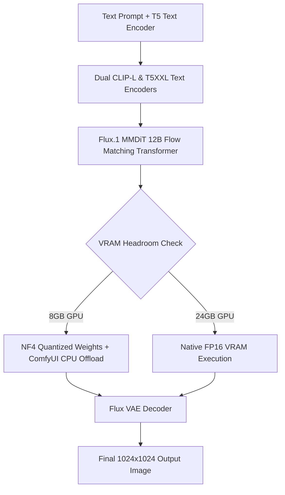

# Running Flux.1 Local Image Generation on Consumer GPUs

Local visual generation reached a major milestone with the release of **Flux.1** by Black Forest Labs (the original creators of Stable Diffusion). Featuring 12 billion parameters, flow matching architecture, and superior prompt adherence, Flux.1 produces photorealistic images, precise text typography, and intricate hands without proprietary cloud subscriptions like Midjourney.

However, unquantized FP16 Flux.1 model weights require over **24 GB of VRAM**, posing a barrier for developers operating standard consumer GPUs.

In this tutorial, you will learn how to deploy Flux.1 locally using **ComfyUI**, leverage **NF4 (Normal Float 4) quantization**, optimize 8GB VRAM CPU offloading, and configure production image generation workflows.

---

## Flux.1 Model Variants & Architectural Comparison

Flux.1 utilizes a hybrid Transfusion architecture combining a multimodal transformer (MMDiT) with flow matching sampling:



### Model Matrix: Schnell vs. Dev vs. Pro

| Parameter Vector | Flux.1 Schnell | Flux.1 Dev | Flux.1 Pro |
|---|---|---|---|
| **Target Audience** | Local Prototyping / Game Dev | High-Detail Creators | Enterprise Cloud API |
| **Open Weights License** | Apache 2.0 (Commercial OK) | Non-Commercial Research | Proprietary API Only |
| **Sampling Steps Required** | **4 steps** | 20 – 50 steps | 25 – 50 steps |
| **NF4 Quantized Size** | ~6.2 GB | ~6.8 GB | N/A (Cloud Hosted) |
| **Generation Speed (RTX 4060)** | **~3.2 seconds / image** | ~28 seconds / image | Cloud Dependent |

---

## Step-by-Step Installation in ComfyUI

### Step 1: Install ComfyUI and Update Extensions

Clone the official ComfyUI repository and install Python requirements:

```bash
git clone https://github.com/comfyanonymous/ComfyUI.git
cd ComfyUI
pip install -r requirements.txt
```

Ensure your CUDA PyTorch runtime is updated to support `bitsandbytes` NF4 quantization:

```bash
pip install bitsandbytes accelerate --upgrade
```

### Step 2: Download Flux.1 Quantized Weights and Encoders

Place the following model files into their respective ComfyUI subdirectories:

1. **UNET / Diffusion Weights** (`ComfyUI/models/unet/`):
   - `flux1-schnell-bnbs-nf4.safetensors` (NF4 Quantized Schnell)
   - `flux1-dev-bnbs-nf4.safetensors` (NF4 Quantized Dev)
2. **Text Encoders** (`ComfyUI/models/clip/`):
   - `clip_l.safetensors` (Standard OpenAI CLIP-L)
   - `t5xxl_fp8_e4m3fn.safetensors` (FP8 Quantized T5 Text Encoder)
3. **VAE Decoder** (`ComfyUI/models/vae/`):
   - `ae.safetensors` (Official Flux VAE)

---

## Building an 8GB VRAM Optimized ComfyUI Workflow

To run Flux.1 on 8GB VRAM consumer GPUs (such as RTX 4060, RTX 3070, or Apple Silicon Macs), use the node layout pattern below:

```json
{
  "1": {
    "inputs": {
      "unet_name": "flux1-schnell-bnbs-nf4.safetensors",
      "weight_dtype": "fp8_e4m3fn"
    },
    "class_type": "UNETLoader"
  },
  "2": {
    "inputs": {
      "clip_name1": "clip_l.safetensors",
      "clip_name2": "t5xxl_fp8_e4m3fn.safetensors",
      "type": "flux"
    },
    "class_type": "DualCLIPLoader"
  },
  "3": {
    "inputs": {
      "vae_name": "ae.safetensors"
    },
    "class_type": "VAELoader"
  },
  "4": {
    "inputs": {
      "text": "A vintage editorial collage illustration of a developer working on a laptop, muted sage green background, halftone dot texture, minimal tech art style",
      "clip": ["2", 0]
    },
    "class_type": "CLIPTextEncode"
  },
  "5": {
    "inputs": {
      "seed": 42,
      "steps": 4,
      "cfg": 1.0,
      "sampler_name": "euler",
      "scheduler": "simple",
      "denoise": 1.0,
      "model": ["1", 0],
      "positive": ["4", 0],
      "negative": ["4", 0],
      "latent_image": ["6", 0]
    },
    "class_type": "KSampler"
  },
  "6": {
    "inputs": {
      "width": 1024,
      "height": 576,
      "batch_size": 1
    },
    "class_type": "EmptyLatentImage"
  }
}
```

---

## Advanced Optimization Commands for Low VRAM Execution

Launch ComfyUI with low-VRAM memory flags to enable dynamic layer offloading:

```bash
# For 8GB VRAM GPUs (RTX 4060 / 3070)
python main.py --lowvram --fp16-vae

# For 6GB VRAM GPUs (GTX 1660 / RTX 3050)
python main.py --novram --fp16-vae
```

> **Performance Note**: The `--lowvram` flag keeps non-active transformer layers stored in System RAM, swapping weight blocks into VRAM only during active forward passes. This prevents Out-Of-Memory (OOM) crashes during high-resolution 1024x1024 generation.

---

## Summary & Key Takeaways

- **Schnell for Speed**: Use `flux1-schnell` (4 steps) for rapid 3-second iteration.
- **NF4 Quantization**: Standardize on `bnbs-nf4` weights to reduce VRAM memory overhead by over 70%.
- **Text Encoder FP8**: Pair CLIP-L with `t5xxl_fp8` to keep total text encoding memory under 4.5 GB.
