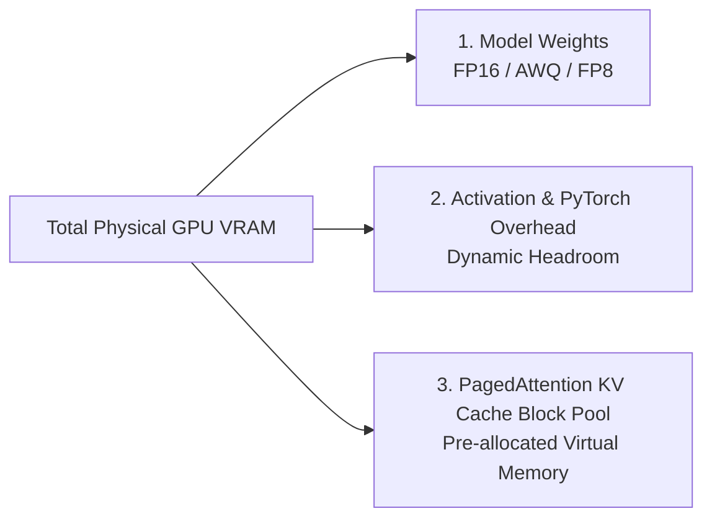
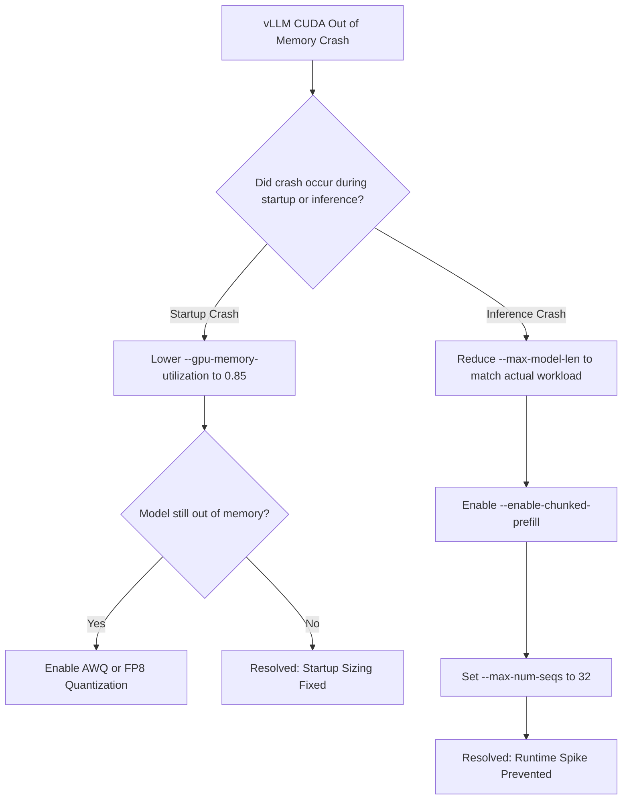

Deploying large language models with vLLM offers exceptional throughput, but encountering `torch.cuda.OutOfMemoryError` or `ValueError: No available memory for the cache block` can halt production pipelines.

This guide provides an exact mathematical and step-by-step diagnostic framework to tune vLLM memory flags and eliminate GPU Out Of Memory (OOM) crashes permanently.

---

## Quick Answer / Immediate Resolution Checklist

If your vLLM container is actively crashing with a `CUDA Out of Memory` error on boot:

1. **Lower `--gpu-memory-utilization`**: Change from `0.90` (default) to `0.85` to give PyTorch initial activation headroom.
2. **Reduce `--max-model-len`**: If your model defaults to a 128k context window, cap it to your actual required maximum (e.g., `--max-model-len 16384`).
3. **Enable Quantization**: Use AWQ, GPTQ, or FP8 quantization (`--quantization fp8`) to halve model weight VRAM.
4. **Enable Chunked Prefill**: Add `--enable-chunked-prefill` to prevent large prompt bursts from spiking activation memory.

---

## Anatomy of vLLM Memory Allocation

To debug memory failures, you must understand how vLLM partitions GPU VRAM into three distinct zones:



### The Memory Formula
When vLLM boots up, it executes a dummy forward pass to measure available memory:

$$\text{Available KV Cache Memory} = (\text{Total VRAM} \times \text{gpu\_memory\_utilization}) - \text{Model Weight Memory} - \text{Peak Activation Memory}$$

If $\text{Available KV Cache Memory} \le 0$, vLLM immediately throws a `CUDA Out of Memory` exception.

---

## Step-by-Step Troubleshooting Guide

### Step 1: Diagnose the Failure Stage

Run your vLLM server with explicit PyTorch memory environment flags to catch allocation stack traces:

```bash
export CUDA_LAUNCH_BLOCKING=1
export TORCH_CUDA_ALLOC_CONF=expandable_segments:True

python3 -m vllm.entrypoints.openai.api_server \
    --model Qwen/Qwen2.5-32B-Instruct \
    --gpu-memory-utilization 0.90 \
    --max-model-len 16384
```

Observe **when** the crash happens:
* **Crash during initialization:** Model weights + default activation overhead exceed `gpu_memory_utilization * VRAM`.
* **Crash during runtime inference:** Long prompt prompts or high concurrent batch sizes spike activation memory past the reserved threshold.

---

### Step 2: Calculate Exact KV Cache Footprint

For long-context workloads (like processing 1M token contexts using models like [Kimi K3](/news/kimi-k3-moonshot-ai-release)), calculating KV cache memory is critical.

$$\text{KV Cache Bytes per Token} = 2 \times N_{\text{layers}} \times N_{\text{kv\_heads}} \times d_{\text{head}} \times \text{BytesPerElement}$$

For a 32-layer model with 8 KV heads, a head dimension of 128, in FP16 (2 bytes):

$$\text{Bytes per Token} = 2 \times 32 \times 8 \times 128 \times 2 = 131,072 \text{ bytes} \approx 131.07 \text{ KB/token}$$

For a single request at 16,384 tokens, the KV cache requires **~2.15 GB of VRAM**. Multiply this by your target concurrency (e.g., 16 parallel requests) and you require **34.4 GB of VRAM** solely for the KV cache.

For context window optimization strategies, see our guide on [Maximizing Kimi K3: Best Practices for 1M Token Context Windows](/best-practices/kimi-k3-context-window-best-practices).

---

### Step 3: Calibrate `--gpu-memory-utilization` and `--max-model-len`

In your deployment startup script, tune `--gpu-memory-utilization` and cap context bounds:

```bash
python3 -m vllm.entrypoints.openai.api_server \
    --model meta-llama/Llama-3.3-70B-Instruct-AWQ \
    --tensor-parallel-size 2 \
    --gpu-memory-utilization 0.88 \
    --max-model-len 8192 \
    --max-num-seqs 64 \
    --enable-chunked-prefill
```

| Flag | Purpose | Recommended Setting |
| :--- | :--- | :--- |
| `--gpu-memory-utilization` | Fraction of total VRAM vLLM can claim | `0.85` – `0.92` |
| `--max-model-len` | Maximum sequence length (prompt + output) | Set to actual project ceiling (e.g. `8192`) |
| `--max-num-seqs` | Maximum concurrent sequences in a batch | `32` – `128` depending on VRAM |
| `--enable-chunked-prefill` | Splits large prompt prefill into chunks | Essential for prompts > 4096 tokens |

---

## Diagnostic Flowchart



---

## Image Specifications & Visual Assets

### Hero Image Instructions
* **Prompt**: "Minimalist 3D technical illustration showing a GPU VRAM memory bar cleanly divided into blue model weights, green KV cache blocks, and a orange dynamic safety buffer, dark background, ultra crisp"
* **Filename**: "vllm-gpu-memory-allocation.png"
* **Alt**: "Technical diagram illustrating GPU VRAM partitioning in vLLM between model weights, KV cache, and activation buffer"
* **Placement**: Top of article below summary checklist
* **Purpose**: Provide visual clarity on how vLLM divides memory and why OOM occurs
* **Aspect ratio**: 16:9

### Supporting Visual 1 Instructions
* **Prompt**: "Flowchart diagram showing vLLM OOM diagnostic decision tree for startup crashes versus runtime inference crashes, modern clean layout"
* **Filename**: "vllm-oom-diagnostic-tree.png"
* **Alt**: "Diagnostic flowchart for resolving vLLM startup and runtime CUDA Out of Memory errors"
* **Placement**: Under Diagnostic Flowchart section
* **Purpose**: Allow engineers to rapidly trace and resolve their specific error state
* **Aspect ratio**: 4:3

### Supporting Visual 2 Instructions
* **Prompt**: "Data table graphic displaying KV cache byte sizes per token across 8B, 32B, and 70B parameter LLMs, clean corporate developer aesthetic"
* **Filename**: "kv-cache-memory-per-token-table.png"
* **Alt**: "Table summarizing KV cache VRAM requirement per token across various model sizes"
* **Placement**: Under Step 2: Calculate Exact KV Cache Footprint
* **Purpose**: Give developers reference numbers for memory planning
* **Aspect ratio**: 16:9

---

## Verification & Monitoring

Once your server launches cleanly, monitor active cache block usage via vLLM's Prometheus metric endpoint (`http://localhost:8000/metrics`):

```text
# HELP vllm:gpu_cache_usage_perc GPU KV-cache usage percentage.
# TYPE vllm:gpu_cache_usage_perc gauge
vllm:gpu_cache_usage_perc{model_name="Qwen/Qwen2.5-32B-Instruct"} 0.42

# HELP vllm:num_requests_waiting Number of requests waiting in queue.
# TYPE vllm:num_requests_waiting gauge
vllm:num_requests_waiting{model_name="Qwen/Qwen2.5-32B-Instruct"} 0
```

If `vllm:gpu_cache_usage_perc` exceeds **0.95**, vLLM will begin offloading KV blocks to CPU RAM or queueing incoming requests.

To compare engine architectures before selecting vLLM for production, read our head-to-head analysis on [vLLM vs Ollama: Production Benchmark & Engine Selection Guide](/comparisons/vllm-vs-ollama-production-inference-benchmarks).
