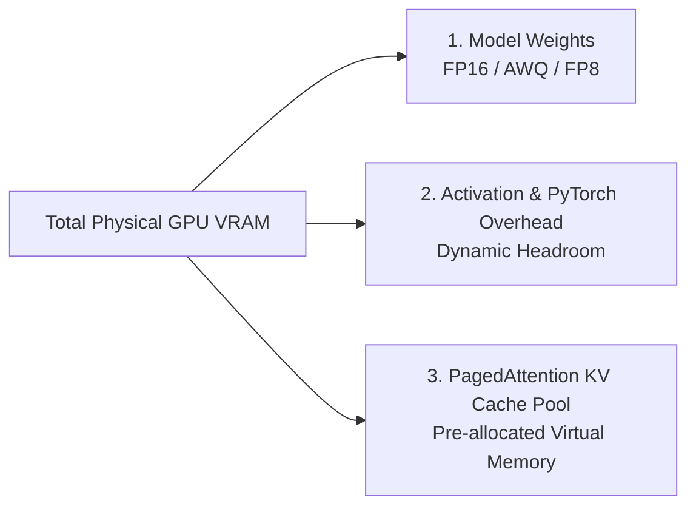
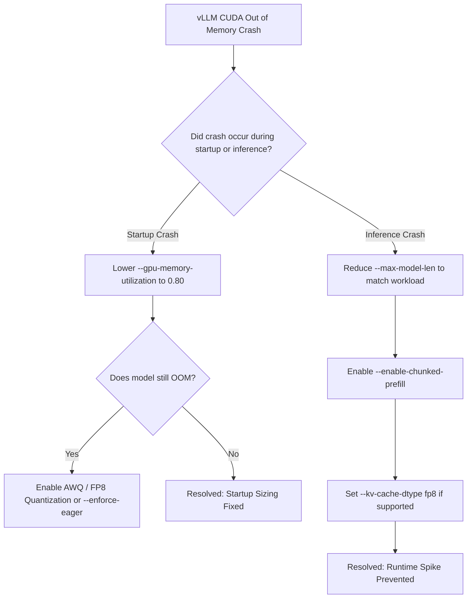

Deploying large language models with vLLM provides high token throughput via PagedAttention, but encountering `torch.cuda.OutOfMemoryError` or `ValueError: No available memory for the cache block` can halt production pipelines.

This guide outlines official vLLM parameter adjustments and theoretical KV cache calculation methods to resolve memory allocation failures.

---

## Quick Diagnostic Checklist

*Sources: vLLM Official Troubleshooting Documentation (`docs.vllm.ai`)*

1. **Lower `--gpu-memory-utilization`**: The default is `0.90`. Lowering to `0.80` or `0.85` frees memory for dynamic activations and PyTorch overhead.
2. **Cap `--max-model-len`**: If a model defaults to a long context window (e.g. 128k), cap it to your actual required maximum (e.g. `--max-model-len 8192`) to reduce pre-allocated KV cache block requirements.
3. **Enable Quantization**: Use AWQ, GPTQ, or FP8 quantization (`--quantization fp8`) to reduce model weight VRAM.
4. **Enable Chunked Prefill**: Use `--enable-chunked-prefill` to prevent large prompt sequences from spiking activation memory.
5. **Use Eager Mode**: Pass `--enforce-eager` to disable CUDA graph memory pre-allocation during startup debugging.

---

## vLLM Memory Allocation Architecture

*Source: vLLM Memory Management Specification (`docs.vllm.ai`)*



### Theoretical KV Cache Calculation (Derived Formula)
vLLM allocates memory for Key-Value pairs across layers and attention heads.

$$\text{KV Cache Bytes per Token} = 2 \times N_{\text{layers}} \times N_{\text{kv\_heads}} \times d_{\text{head}} \times \text{BytesPerElement}$$

*For example: A model with 32 layers, 8 KV heads, a head dimension of 128, using FP16 precision (2 bytes per element):*

$$\text{Bytes per Token} = 2 \times 32 \times 8 \times 128 \times 2 = 131,072 \text{ bytes} \approx 131.07 \text{ KB/token}$$

Multiplying this figure by sequence length and concurrent batch size yields the theoretical minimum KV cache VRAM requirement.

For long-context optimization concepts, see [Maximizing Kimi K3: Best Practices for 1M Token Context Windows](/best-practices/kimi-k3-context-window-best-practices).

---

## Parameter Reference Table

*Source: Official vLLM CLI Flag Documentation (`docs.vllm.ai`)*

| Parameter Flag | Default | Description & Recommended Fix |
| :--- | :--- | :--- |
| `--gpu-memory-utilization` | `0.90` | Fraction of GPU VRAM reserved for vLLM. Lower to `0.80` if CUDA OOM occurs. |
| `--max-model-len` | Model Config | Maximum sequence length. Restrict to actual workload ceiling to save KV cache. |
| `--max-num-seqs` | `256` | Maximum concurrent sequences in a batch. Lower under heavy VRAM constraints. |
| `--enable-chunked-prefill` | `False` | Chunks long prompt prefills to stabilize memory consumption. |
| `--enforce-eager` | `False` | Disables CUDA graph execution, eliminating CUDA graph memory pre-allocation. |
| `--kv-cache-dtype` | `auto` | Data type for KV cache blocks (`auto`, `fp8`). `fp8` reduces KV cache memory footprint. |

---

## Diagnostic Flowchart



---

## Prometheus Metric Monitoring

*Source: Official vLLM Metrics Documentation (`docs.vllm.ai`)*

You can track active memory pressure by scraping vLLM's metric endpoint (`/metrics`):

```text
## HELP vllm:gpu_cache_usage_perc GPU KV-cache usage percentage.
## TYPE vllm:gpu_cache_usage_perc gauge
vllm:gpu_cache_usage_perc{model_name="model"} 0.42

## HELP vllm:num_requests_waiting Number of requests waiting in queue.
## TYPE vllm:num_requests_waiting gauge
vllm:num_requests_waiting{model_name="model"} 0
```

When `vllm:gpu_cache_usage_perc` approaches `1.0`, vLLM will begin queuing incoming requests or preempting active sequences.

For an architectural comparison between vLLM and Ollama, read our guide on [vLLM vs Ollama: Architectural & Memory Management Comparison](/comparisons/vllm-vs-ollama-architectural-comparison).
