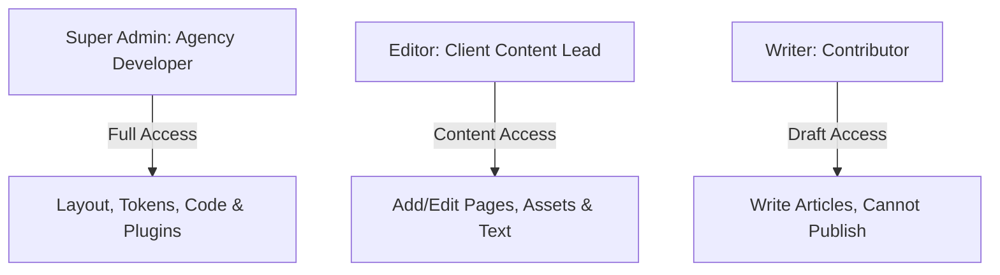

Delivering a visual website design to a client is often a nerve-wracking process. Without strict boundaries, content editors can accidentally modify layout alignments, break typography consistency, or delete page components.

**Instatic CMS**—the MIT licensed open-source visual page builder—addresses this issue with a built-in **user and role management system**. Running on a high-performance **Bun and TypeScript** backend, Instatic saves these security rules to the local database (SQLite by default, or PostgreSQL for teams) and compiles pages into static HTML with **zero builder or hydration bloat**.

This guide explains how agencies use Instatic to lock down page layouts while allowing clients to easily publish content.

---

## The Role Permission Hierarchy

Instatic allows you to create custom roles with specific feature access. Agencies generally use a three-tier permission model:

---

## Structuring the Client Hand-off

To ensure a smooth, worry-free website delivery, follow this setup:

1. **Restrict Canvas Editing**: Remove permissions to edit CSS classes or design system variables for client roles. This prevents editors from changing colors or spacing.
2. **Lock Structural Layouts**: Allow clients to update placeholder fields (such as headings, body copy, and images) while locking the wrapping container elements.
3. **Configure Audit Logs**: Keep the Audit Log enabled to trace issues back to specific updates if layout inconsistencies arise.

---

## Editor Team Workflows

Watch how team permissions and visual canvas settings are managed inside the editor:

  <iframe src="https://www.youtube.com/embed/O88lL2v3JkA" title="YouTube video player" frameborder="0" allow="accelerometer; autoplay; clipboard-write; encrypted-media; gyroscope; picture-in-picture" allowfullscreen class="w-full h-full"></iframe>

---

## Key Takeaways & Alpha Warnings
- **Safe Hand-offs**: Protect website designs by blocking editor access to style attributes.
- **Traceable Changes**: Use audit logging to see who modified content and when.
- **Independent Roles**: Set custom permissions for external contributors, review teams, and developers.
- **Alpha Warnings**: Given the project's **early alpha status**, test user authentication credentials on a local SQLite instance before deploying container nodes for active client edits.
