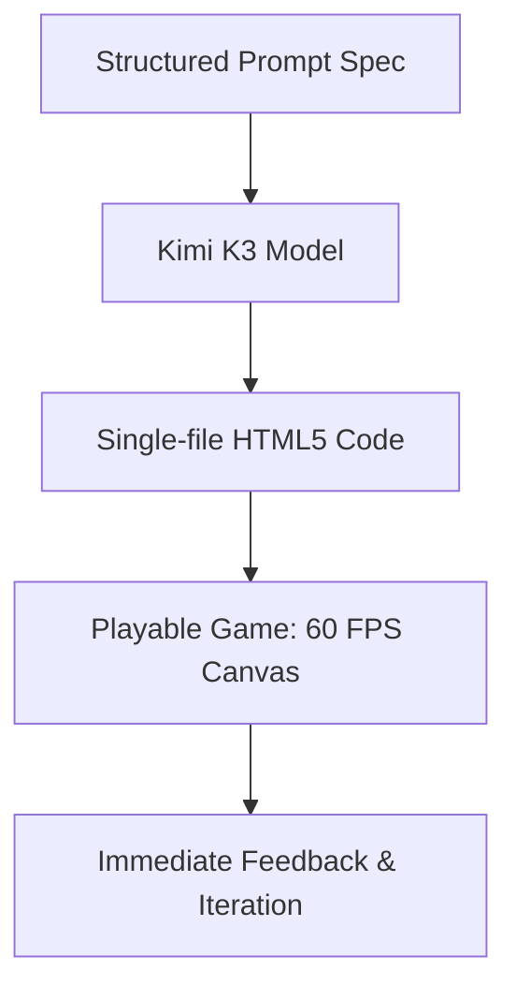

The release of Moonshot AI's **Kimi K3** has introduced a powerful engine for creative developers and technical designers. Thanks to its **2.8 trillion parameter** Mixture of Experts scale and native vision capabilities, Kimi K3 excel at one of the most challenging areas for generative AI: **procedural prototyping and game asset generation**.

This article breaks down how development teams and indie creators are leveraging Kimi K3 to build games, design 3D mechanics, and accelerate web interface prototyping.

---

## 1. Zero-Dependency Browser Games

One of the most impressive use cases for Kimi K3 is the rapid generation of self-contained web games. Using structured prompt scripting, developers can ask Kimi K3 to output fully functional, single-file HTML5 games:

These games include dynamic collision boxes, score tracking, animated SVG graphics, and responsive keyboard/mouse controls. Because Kimi K3 handles logic generation from first principles, it doesn't need external frame rendering dependencies, resulting in lightning-fast load times.

---

## 2. 3D Printable Physical Asset Specifications

Kimi K3's vision capabilities and mathematical precision allow it to cross the boundary between software and physical production. Designers use it to compile physical tolerance specifications and structural geometries:
* **Support-free Geometry**: Designing printable structures that don't require support structures (saving filament and clean-up time).
* **Logical Tolerances**: Writing exact scale requirements (e.g., maintaining a `0.4mm` gap for a moving gear assembly) to ensure parts fit together in the real world.
* **CAD Scripts**: Outputting precise mathematical shapes for translation into OpenSCAD scripts.

---

## 3. UI/UX Prototype Wireframing

By uploading a screenshot of an existing layout or drawing a mockup on paper, developers can use Kimi K3's vision inputs to:
1. Parse the visual alignment, color palette, and margin system.
2. Compile and output a clean, modern web interface.
3. Automatically correct layouts (e.g., making layouts mobile-responsive using flexbox containers).

This accelerates the transition from early concepts to actual clickable layouts, letting designers validate visual balance and functionality in real-time.

---

## Image Asset Specifications

* **Hero Image**:
  - **Prompt**: "Editorial style design showing a glowing game controller intersecting clean wireframe geometry, pastel blue background, minimal vectors."
  - **Filename**: "kimi-k3-game-dev-hero.png"
  - **Alt text**: "Kimi K3 game prototyping illustration"
  - **Caption**: "Accelerating physical and digital game asset prototyping using Kimi K3."
  - **Placement**: Top of page
  - **Purpose**: Title hero asset
  - **Aspect ratio**: 16:9
* **Supporting Visual 1**:
  - **Prompt**: "Minimalist wireframe layout of a browser game screen, showing score counters and collision vectors, soft purple line art."
  - **Filename**: "game-wireframe-layout.png"
  - **Alt text**: "Browser game wireframe collision vectors layout"
  - **Caption**: "Prototyping responsive collision detection and layout rules."
  - **Placement**: Under 'Zero-Dependency Browser Games' section
  - **Purpose**: Illustrate design logic
  - **Aspect ratio**: 4:3
* **Supporting Visual 2**:
  - **Prompt**: "A clean CAD engineering schematic representing support-free printer joints, blue blueprints style with white text details."
  - **Filename**: "cad-tolerances-schematic.png"
  - **Alt text**: "CAD printable tolerances schematic"
  - **Caption**: "Generating exact real-world dimensions and tolerances for mechanical parts."
  - **Placement**: Under '3D Printable Physical Asset Specifications' section
  - **Purpose**: Depict hardware feasibility
  - **Aspect ratio**: 4:3
