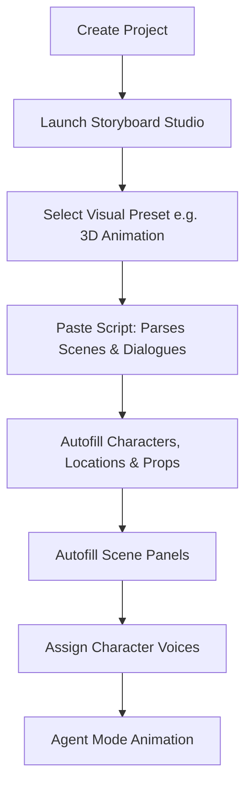

AI-powered filmmaking has historically suffered from a lack of structure. Translating a text script into a sequence of consistent shots (maintaining characters, locations, and assets) typically required jumping between multiple independent image generators, editing software, and writing assistants.

Google Flow’s new **Storyboard Studio** addresses this bottleneck. It offers a unified pre-production dashboard that parses scripts, generates consistent visual reference sheets, and animates story panels directly.

---

## Storyboard Studio Workflow Sequence

Storyboard Studio operates as a linear pre-production pipeline. Below is the workflow diagram:

### 1. Script Organization
After launching the studio, you paste in your script. Google Flow automatically breaks the text down into individual scenes, parsing description blocks into actions and character dialogue.

### 2. Autofill Assets
Instead of manual prompt writing, the Assets tab features three automation buttons:
- **Autofill Characters**: Reads names and descriptions to create profile sheets.
- **Autofill Locations**: Generates matching environments.
- **Autofill Props**: Compiles necessary objects.

All generated assets are linked, ensuring consistency when scenes are rendered in subsequent steps.

### 3. Storyboard Panels & Voice Over
The Storyboard tab arranges scenes in sequence. Clicking **Autofill Scene** renders corresponding images using the assets created. Once panels are ready, you select the Cast panel, assign custom voices to your characters, and preview them before launching generation.

### 4. Agent Mode Animation
To animate a panel, you send the frame to the prompt box and paste the matching script description. Using **Agent Mode**, Google Flow automatically builds an optimized prompt. Adding the specific character name tag helps the engine identify exactly who is active, outputting a synchronized, talking animation.

> [!WARNING]
> Always manually save your project progress. Storyboard Studio does not auto-save state, and closing the browser without clicking save will wipe out your current script analysis and asset structures.

---

## Editorial Image Asset Checklist

### 1. Hero Image
- **Prompt**: Sleek 3D canvas showcasing parsed scenes, floating assets panel, and a timeline editor cards layout. Light cyan and sky-blue accents, natural sunlight, minimalist Apple workspace style.
- **Filename**: `/images/youtube/google-flow-storyboard-hero.png`
- **Alt Text**: Visual overview of the Storyboard Studio interface in Google Flow.
- **Caption**: Figure 1: Google Flow’s new Storyboard Studio pre-production dashboard.
- **Placement**: Directly below the frontmatter title.
- **Purpose**: Establishes the visual workspace of Storyboard Studio.
- **Aspect Ratio**: 16:9

### 2. Supporting Visual 1
- **Prompt**: Clean schematic layout of script parsing panels, dividing script lines into colorful cards marked "Dialogue" in soft purple and "Action" in sky blue. White desktop background.
- **Filename**: `/images/youtube/script-parsing-panel.png`
- **Alt Text**: Parsed script panel showing scene segmentation.
- **Caption**: Figure 2: Automatic scene, action, and dialogue segmentation.
- **Placement**: Under the "Script Organization" section.
- **Purpose**: Illustrates script analysis and segmentation interface.
- **Aspect Ratio**: 16:9

### 3. Supporting Visual 2
- **Prompt**: Elegant representation of consistent character profile sheets, showing character face references from multiple angles under soft studio lighting. Minimalist workspace look.
- **Filename**: `/images/youtube/character-asset-sheets.png`
- **Alt Text**: Consistent character sheets generated in Google Flow assets panel.
- **Caption**: Figure 3: Maintaining asset consistency using character reference profiles.
- **Placement**: Under the "Autofill Assets" section.
- **Purpose**: Demonstrates the asset database mechanics.
- **Aspect Ratio**: 16:9

---

## Key Takeaways
- **Structured Pre-Production**: Google Flow transitions AI video generation from unstructured prompting to structured scene pipelines.
- **Automated Breakdown**: Pasting a script automatically generates matching scenes, dialogues, actions, and assets.
- **Consistency Engine**: Linked asset profiles ensure characters, environments, and props remain consistent across scenes.
- **Agent Mode Prompts**: Agent Mode simplifies the animation step by converting raw script actions into optimized render prompts.

---

## Internal Linking Opportunities
- Deep dive into the studio capabilities in our [Google Flow Storyboard Studio feature analysis](file:///c:/Users/jasva/Nadhebe/src/content/tools/google-flow-storyboard-studio-pre-production.md).
- Follow our step-by-step filmmaking process in the [Google Flow AI Filmmaking Tutorial](file:///c:/Users/jasva/Nadhebe/src/content/tutorials/google-flow-storyboard-studio-ai-filmmaking.md).
- Learn how developers route general model tasks in [Multi-Model Gateways Guide](file:///c:/Users/jasva/Nadhebe/src/content/guides/multi-model-orchestration-api-gateways.md).
