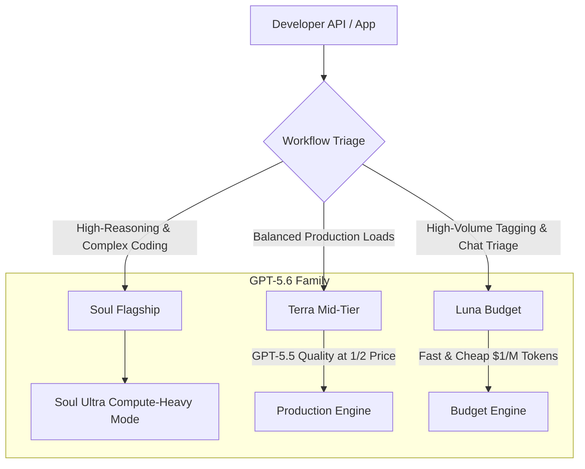

The release of OpenAI’s **GPT-5.6 Autonomous Engine** in July 2026 marks a definitive shift in the AI landscape. We are officially leaving the era of simple conversational chatbots behind. AI is transitioning into a **digital workforce**—a suite of persistent, self-correcting agents capable of planning, coding, and orchestrating complex tasks independently. 

In this explainer, we deconstruct the architecture of the GPT-5.6 family, analyze how its tiers (Soul, Terra, and Luna) operate, evaluate benchmark data, and highlight the real-world resource constraints developers face when deploying these systems.

---

## Deconstructing the Tiers: Soul, Terra, and Luna

OpenAI has replaced its previous suffix-based naming structure (such as *mini* or *nano*) with a simplified three-tier system designed to match specific developer workloads, budgets, and capabilities.



### 1. Soul (The Flagship)
Soul is the top-tier model built for the most demanding agentic coding, math, and multi-step reasoning tasks. It operates at standard flagship pricing ($5 per million input tokens, $30 per million output tokens). Sitting directly above this model is **Soul Ultra**, a compute-heavy configuration triggered when failure is too expensive, spending maximum inference time to solve multi-step problems.

### 2. Terra (The Production Workhorse)
Terra represents the enterprise sweet spot. It provides capabilities and response quality equivalent to the older GPT-5.5 model, but at exactly half the price, making it the primary target for standard daily workloads.

### 3. Luna (The High-Volume Utility)
Luna is the fastest and most budget-friendly tier ($1 per million input tokens). It is designed to run low-cost triage, simple tagging, and quick summaries at scale.

### Shared 1-Million Token Context
Crucially, OpenAI does not restrict memory context by tier. Every model in the GPT-5.6 family—including Luna—shares a **1-million token context window**, ensuring developers never have to sacrifice history capacity due to budget constraints.

---

## The Raw Performance Data: Benchmarks vs. Competitors

To measure how GPT-5.6 handles persistent execution, we examine its performance on **Terminal Bench 2.1** (measuring complex command-line planning and tool calling) and the **SWE-bench Pro** software engineering assessment:

| Model / Tier | Terminal Bench 2.1 | SWE-bench Pro | Agent's Last Exam |
| :--- | :---: | :---: | :---: |
| **Soul Ultra (Compute-Heavy)** | **91.9%** | — | — |
| **Soul (Base)** | 88.8% | 64.6% | **53.6%** |
| **Claude Fable 5 (Anthropic)** | 88.0% | **80.3%** | 40.6% |
| **GPT-5.5 (Previous Gen)** | 79.2% | 48.9% | 31.0% |

While Soul Ultra dominates Terminal Bench 2.1, the evaluation highlights a competitive split: Soul beats Claude Fable 5 by 13 points on agent persistence benchmarks, but Claude Fable 5 maintains a strong lead on SWE-bench Pro. OpenAI audited the SWE-bench Pro test suite, claiming that up to 30% of the tasks are broken or poorly specified, illustrating the difficulty of testing frontier systems.

---

## Programmatic Tool Calling & Multi-Agent Teams

The core engine improvement in GPT-5.6 is **programmatic tool calling**. Instead of outputting JSON payloads for the client to execute, the model writes its own execution scripts (typically in lightweight JavaScript) to manage its actions. 

This enables the model to:
- Spin up parallel sub-agents to divide tasks.
- Watch progress in real-time.
- Capture run-time errors and self-correct.
- Run loops until a pre-defined validation checklist is met.

```javascript
// Conceptual representation of GPT-5.6's autonomous orchestration block
async function orchestrateWorkspace() {
  const subAgentPool = await openai.agents.createPool(3);
  const tasks = ["analyzeLogs", "fetchGitHistory", "patchVulnerability"];
  
  const results = await Promise.all(
    tasks.map((task, idx) => subAgentPool[idx].execute(task))
  );
  
  if (validate(results)) {
    return commitChanges(results);
  } else {
    return selfCorrect(results);
  }
}
```

---

## The Compute Bottleneck: Draining Daily Limits in Minutes

While the autonomous engine is highly capable, it is extremely resource-intensive. On launch day, a Reddit developer deployed **Soul Ultra** to analyze and merge 10 massive PDFs (700 pages of text) while running a cleanup routine on a 700-file Obsidian markdown vault. 

Because the engine spun up multiple parallel sub-agents and executed self-correction code, it consumed the user's entire daily ChatGPT Plus allowance in **exactly 12 minutes**. 

### The Orchestration Takeaway
This highlights why **cost per solved task** is more critical than price per token. Developers cannot deploy flagship Soul models for every sub-step. Instead, teams must construct multi-model pipelines—routing document parsing to Luna, metadata extraction to Terra, and reserving Soul exclusively for final verification and architectural decisions.

---

## Editorial Image Asset Checklist

### 1. Hero Image
- **Prompt**: A high-end developer workspace in bright, natural daylight. A sleek monitor displays a clean, glassmorphic UI editor where dynamic nodes and connections represent sub-agents spawning in parallel. Soft purple and blue gradient backgrounds, lots of whitespace, minimalist Apple aesthetic.
- **Filename**: `/images/youtube/gpt-5-6-autonomous-engine-hero.png`
- **Alt Text**: Clean 3D illustration of an autonomous AI engine interface displaying sub-agent nodes and connections.
- **Caption**: Figure 1: OpenAI's GPT-5.6 interface orchestrates parallel sub-agents.
- **Placement**: Directly below the frontmatter title.
- **Purpose**: Establishes the premium visual tone of the article.
- **Aspect Ratio**: 16:9

### 2. Supporting Visual 1
- **Prompt**: Minimalist schematic diagram on a pure white background showing three floating card tiers labeled "Soul", "Terra", and "Luna". Glassmorphism effects with light cyan and mint borders, high contrast, clean typography.
- **Filename**: `/images/youtube/gpt-5-6-model-tiers.png`
- **Alt Text**: Visual cards representing Soul, Terra, and Luna tiers.
- **Caption**: Figure 2: The three-tier model family structure of GPT-5.6.
- **Placement**: Under the "Deconstructing the Tiers" section.
- **Purpose**: Clarifies the product segmentation visually.
- **Aspect Ratio**: 16:9

### 3. Supporting Visual 2
- **Prompt**: A bright screen detailing a terminal interface with clean green and purple line graphs representing API cost optimization curves, floating over a modern light gray desktop workspace with soft shadows.
- **Filename**: `/images/youtube/gpt-5-6-cost-chart.png`
- **Alt Text**: Clean UI graph showing token usage versus solved task efficiency.
- **Caption**: Figure 3: Token consumption vs. task accuracy trade-offs.
- **Placement**: Under the "The Compute Bottleneck" section.
- **Purpose**: Illustrates the concept of cost-per-solved-task optimization.
- **Aspect Ratio**: 16:9

---

## Key Takeaways
- **Agentic Era**: GPT-5.6 transitions AI from a reactive text generator to a proactive digital workforce.
- **Workload Routing**: The Soul, Terra, and Luna models provide distinct capabilities to balance API performance and cost.
- **Resource Intensive**: Without multi-tier pipeline optimization, high-effort modes like Soul Ultra will deplete API allowances rapidly.
- **Self-Correction**: Programmatic tool calling allows the model to run validation loops internally, raising Terminal Bench scores to 91.9%.

---

## Internal Linking Opportunities
- Check out our breaking news on the [GPT-5.6 Government Vetting Vitals](file:///c:/Users/jasva/Nadhebe/src/content/news/gpt-5-6-trump-administration-safety-delay.md) for details on safety policies.
- Compare performances in our [GPT-5.6 vs. Claude Fable 5 Benchmark Review](file:///c:/Users/jasva/Nadhebe/src/content/comparisons/gpt-5-6-vs-claude-fable-5-benchmarks.md).
- Learn how to deploy cost-effective gateways in our [Multi-Model Orchestration Guide](file:///c:/Users/jasva/Nadhebe/src/content/guides/multi-model-orchestration-api-gateways.md).
- Review [Programmatic Tool Calling Developer Guide](file:///c:/Users/jasva/Nadhebe/src/content/tools/gpt-5-6-programmatic-tool-calling.md) to build custom sub-agent code structures.
