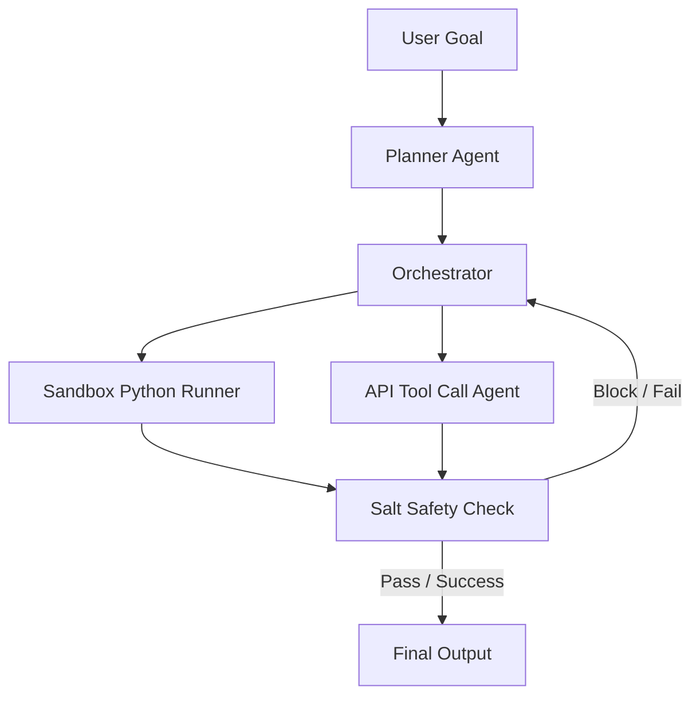

# Unpacking GPT-5.6's Autonomous Engine

OpenAI's July 2026 launch of **GPT-5.6** has marked a cinematic transition in the landscape of artificial intelligence. Moving beyond traditional chat interfaces, this release introduces three distinct tiers optimized for agentic operations, all featuring a native **1 million token context window**:

1. **Soul (Flagship)**: Designed for demanding coding, logic operations, and comprehensive multi-agent coordination.
2. **Terra (Everyday)**: Designed as an everyday production model, offering performance levels comparable to GPT-5.5 at half the API token costs.
3. **Luna (High-speed)**: A low-latency, budget-friendly option optimized for simple utility tasks and fast feedback loops.

## Benchmark Dominance and Capabilities

In **Terminal Bench 2.1**, which evaluates complex, multi-step command-line agentic workflows and tool interactions, the flagship **Soul** model achieved a record-breaking **88.8% success score**. The engine is built for continuous, self-correcting loops:

* **Parallel Execution**: Spinning up concurrent sub-agents to parse files and execute tasks simultaneously.
* **Sandbox Python Execution**: Running and validating scripts dynamically within isolated environments.
* **Self-Correction Loops**: Reading runtime stack traces to refactor and retry failed executions without human prompts.

### Usage Cap Drain Example
On launch day, testers noted that running parallel agent loops can deplete daily token caps in minutes. For example, one developer tasked the Soul model with parsing 10 PDFs, merging them into a single 700-page document, and cleaning up a 700-file Obsidian vault. Running parallel sub-agents to execute these file manipulations consumed the user's daily allocation in just **12 minutes**.

## Safety and the "Salt" Framework

Autonomous capabilities have elevated safety discussions regarding the **critical cyber threshold**—the point at which an AI model can autonomously conduct end-to-end cyberattacks. OpenAI's red teaming confirmed that while GPT-5.6's Soul model can identify vulnerabilities, it cannot autonomously carry out attacks. To secure this threshold, OpenAI introduced **"Salt"**, a new safety framework that monitors agent actions and blocks potentially harmful operations.

### Image Metadata
* **Hero Image**:
  - **Prompt**: "Minimal premium illustration of a glowing holographic crystalline neural network structure, floating over a soft cyan and white background, photorealistic daylight, glassmorphism UI overlay"
  - **Filename**: "gpt-5-6-hero.jpg"
  - **Alt**: "Holographic neural network over cyan gradient"
  - **Caption**: "GPT-5.6 Soul conceptualizes agentic compute."
  - **Placement**: "Top"
  - **Aspect Ratio**: "16:9"
* **Supporting Visual 1**:
  - **Prompt**: "Clean editorial style diagram showing agentic task orchestration, light grey grid background, pastel blue cards"
  - **Filename**: "gpt-5-6-orchestration.jpg"
  - **Alt**: "Task orchestration diagram"
* **Supporting Visual 2**:
  - **Prompt**: "Close-up of a high-end designer office desk, bright daylight, minimal workspace, subtle UI overlay cards showing performance stats"
  - **Filename**: "gpt-5-6-workspace.jpg"
  - **Alt**: "Minimal tech workspace"