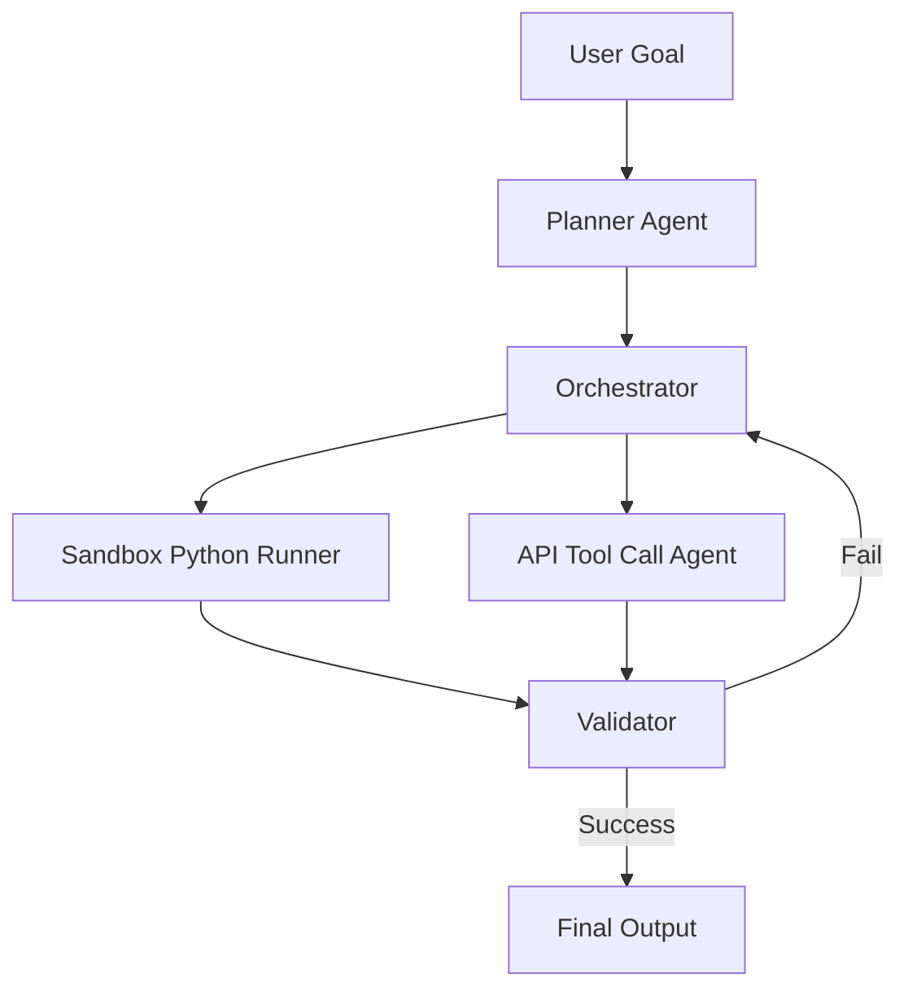

# Unpacking GPT-5.6's Autonomous Engine

OpenAI's July 2026 launch of **GPT-5.6** has marked a cinematic transition in the landscape of artificial intelligence. It introduces the **Soul Ultra** model, which is not merely a conversational partner but a fully realized **autonomous engine** capable of planning, coding, and executing complex workflows without human intervention.

## The Paradigm Shift to Agentic Compute

Traditional large language models (LLMs) operate on a simple request-response cycle. GPT-5.6 shifts this paradigm by incorporating an internal loop structure that enables the model to split a high-level goal into discrete tasks, evaluate its own code execution, and correct errors on the fly.

### Launch Day Insights: The 12-Minute Usage Drain
On launch day, early testers reported hitting usage caps within minutes. One notable developer tasked the Soul Ultra model with reading 10 PDFs, merging them into a 700-page document, and cleaning up a 700-file Obsidian vault. The engine executed both tasks in parallel, utilizing custom code execution sandboxes, and consumed the user's daily token allocation in just **12 minutes**. 

This demonstrates the sheer compute appetite of agentic loops:
* **Parallel Execution**: Spinning up concurrent sub-agents to parse files.
* **Self-Correction Loops**: Running, testing, and debugging Python scripts in sandbox environments.
* **Tool Orchestration**: Interacting with local filesystems and APIs dynamically.

## Behind the Architecture of Soul Ultra

The Soul Ultra model achieves this autonomy by splitting cognitive loads:

This structural separation isolates runtime timeouts from the core planning layers, ensuring that failures in individual tools do not crash the entire agentic run.

### Image Metadata
* **Hero Image**:
  - **Prompt**: "Minimal premium illustration of a glowing holographic crystalline neural network structure, floating over a soft cyan and white background, photorealistic daylight, glassmorphism UI overlay"
  - **Filename**: "gpt-5-6-hero.jpg"
  - **Alt**: "Holographic neural network over cyan gradient"
  - **Caption**: "GPT-5.6 Soul Ultra conceptualizes agentic compute."
  - **Placement**: "Top"
  - **Aspect Ratio**: "16:9"
* **Supporting Visual 1**:
  - **Prompt**: "Clean editorial style diagram showing agentic task orchestration, light grey grid background, pastel blue cards"
  - **Filename**: "gpt-5-6-orchestration.jpg"
  - **Alt**: "Task orchestration diagram"
* **Supporting Visual 2**:
  - **Prompt**: "Close-up of a high-end designer office desk, bright daylight, minimal workspace, subtle UI overlay cards showing performance stats"
  - **Filename**: "gpt-5-6-workspace.jpg"
  - **Alt**: "Minimal tech workspace"