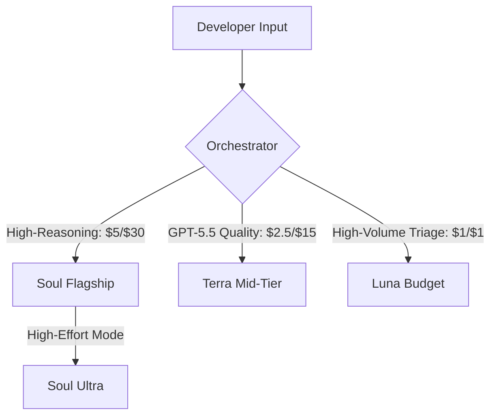
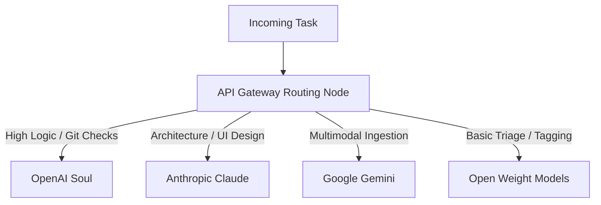

The release of OpenAI’s **GPT-5.6 family** represents a major shift in how AI applications are built and priced. Instead of a single model, developers now have a tiered toolkit designed to balance cost, speed, and reasoning depth.

In this deep dive, we deconstruct the model pricing, analyze competitive benchmarks, explore real-world limits, and explain why **multi-model orchestration** is becoming the essential skill for modern developers.

---

## Deconstructing the Tiers & Pricing

OpenAI’s new model hierarchy maps out a specific cost-and-capability curve. All tiers share a **1-million token context window** but target different workloads:

### 1. Soul (The Logic Specialist)
Soul is priced at **$5.00 per million input tokens** and **$30.00 per million output tokens**. It is designed for complex reasoning, math, and agentic workflows. Developers can trigger **Soul Ultra**, which runs intensive validation loops, when task execution is critical.

### 2. Terra (The Mid-Tier Value)
Terra cuts the cost of previous GPT-5.5 quality exactly in half, operating at **$2.50 per million input tokens** and **$15.00 per million output tokens**. It serves as the primary engine for standard data processing.

### 3. Luna (The High-Volume Triage)
Luna is priced at a budget-friendly **$1.00 per million input tokens**. It is designed to run low-cost classification, tagging, and quick summaries at scale.

---

## Benchmark Audit: Soul vs. Competitors

To assess how GPT-5.6 handles persistent execution, we examine its performance on **Terminal Bench 2.1** (complex CLI operations) and the **SWE-bench Pro** software engineering assessment:

| Evaluation Metric | GPT-5.6 Soul Ultra | GPT-5.6 Soul (Base) | Claude Fable 5 | Claude Myths 5 |
| :--- | :---: | :---: | :---: | :---: |
| **Terminal Bench 2.1** (CLI) | **91.9%** | 88.8% | 86.4% | 88.0% |
| **SWE-bench Pro** (Git Patches) | — | 64.6% | **80.3%** | 76.5% |
| **Agent's Last Exam** (Logic) | — | **53.6%** | 40.6% | 42.1% |

While Soul Ultra dominates Terminal Bench 2.1, the evaluation highlights a competitive split: Soul beats Claude Fable 5 by 13 points on agent persistence benchmarks, but Claude Fable 5 maintains a strong lead on SWE-bench Pro. OpenAI audited the SWE-bench Pro test suite, claiming that up to 30% of the tasks are broken or poorly specified, illustrating the difficulty of testing frontier systems.

---

## Real-World Limits & Automated Review Precision

While Soul is highly capable, deploying it presents two major challenges:

### 1. Compute Bottleneck
High-effort modes like **Soul Ultra** are resource-intensive. On launch day, a developer deployed Soul Ultra to merge a 700-page PDF and clean up a 700-file Obsidian markdown vault. The engine consumed the user's entire daily ChatGPT Plus allowance in **exactly 12 minutes**, highlighting the need for efficient task routing.

### 2. Review Precision Limits
When evaluated as an automated code reviewer, Soul caught a high number of code defects but scored only **31.6% in actionable precision**. This means that without strict output filters, the model can generate a high volume of nitpicks that overwhelm developer teams, leading to alert fatigue.

---

## The Future: Multi-Model Gateway Orchestration

To balance capability and cost, leading software teams are moving away from single-model dependencies and adopting **API gateway routing** (using platforms like Eden AI).

By routing tasks dynamically based on their specific complexity, developers can leverage the strengths of each model provider while maintaining an efficient budget.

---

## Editorial Image Asset Checklist

### 1. Hero Image
- **Prompt**: Minimalist, clean 3D illustration of an orchestration dashboard routing tasks dynamically to different servers. Warm daylight, soft cyan and mint gradients, lots of white space, magazine quality.
- **Filename**: `/images/youtube/gpt-5-6-deep-dive-hero.png`
- **Alt Text**: Orchestration dashboard showing task distribution pipelines.
- **Caption**: Figure 1: Dynamic routing architectures across multiple AI models.
- **Placement**: Directly below the frontmatter title.
- **Purpose**: Establishes the multi-model orchestration theme of the article.
- **Aspect Ratio**: 16:9

### 2. Supporting Visual 1
- **Prompt**: Visual chart illustrating the pricing hierarchy of Soul, Terra, and Luna, showing cost canisters in bright cyan, soft gray, and mint on a clean background.
- **Filename**: `/images/youtube/pricing-hierarchy.png`
- **Alt Text**: Visual chart comparing input and output pricing of GPT-5.6 tiers.
- **Caption**: Figure 2: The pricing structure of the GPT-5.6 model family.
- **Placement**: Under the "Deconstructing the Tiers & Pricing" section.
- **Purpose**: Clarifies the pricing differences for the reader.
- **Aspect Ratio**: 16:9

### 3. Supporting Visual 2
- **Prompt**: Elegant representation of a code review interface showing highlights in soft red and patches in soft green. Clean dashboard frames, white background.
- **Filename**: `/images/youtube/code-review-dashboard.png`
- **Alt Text**: Code review dashboard showing precision vs alert fatigue logs.
- **Caption**: Figure 3: Filtering code reviews to manage precision and reduce noise.
- **Placement**: Under the "Real-World Limits & Automated Review Precision" section.
- **Purpose**: Visualizes code review metrics.
- **Aspect Ratio**: 16:9

---

## Key Takeaways
- **Orchestration Skills**: Successful development teams focus on dynamic orchestration and workload routing rather than raw prompting.
- **Task Efficiency**: Focus on the tokens needed to resolve a task, not just the list price per token.
- **Validation Loops**: Soul Ultra uses intensive validation loops to achieve high Terminal Bench scores (91.9%).
- **Gateway Architecture**: Implement API gateways to route tasks dynamically between Soul, Claude, and Gemini based on their strengths.

---

## Internal Linking Opportunities
- Review details on the launch in our [GPT-5.6 Autonomous Engine review](file:///c:/Users/jasva/Nadhebe/src/content/youtube-articles/gpt-5-6-autonomous-engine.md).
- Understand safety regulations in our [GPT-5.6 Safety Delay analysis](file:///c:/Users/jasva/Nadhebe/src/content/news/gpt-5-6-trump-administration-safety-delay.md).
- Read benchmark scores in [GPT-5.6 vs. Claude Fable 5 Comparison](file:///c:/Users/jasva/Nadhebe/src/content/comparisons/gpt-5-6-vs-claude-fable-5-benchmarks.md).
- Read how to use routing gateways in our [Multi-Model Orchestration Guide](file:///c:/Users/jasva/Nadhebe/src/content/guides/multi-model-orchestration-api-gateways.md).
