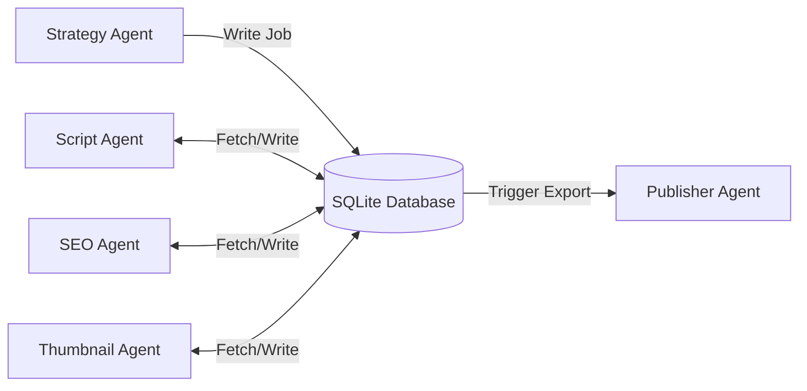

# Inside the Multi-Agent YouTube Automation System

The **YouTube Automation Agent** is an open-source project featuring a loosely coupled **multi-agent architecture**. By using a central **SQLite database** to coordinate tasks, the system isolates errors and enables continuous execution across the video production pipeline.

## The Architecture of a Seven-Agent Studio

The system divides responsibilities among seven specialized agents:

1. **Content Strategy Agent**: Queries APIs to isolate high-performing topics.
2. **Scriptwriter Agent**: Generates drafts using structured prompt templates.
3. **Thumbnail Designer Agent**: Renders visual concept variations.
4. **SEO Optimizer Agent**: Generates titles, descriptions, and tags.
5. **Quality Controller**: Validates the output script for factual accuracy.
6. **Voiceover Coordinator**: Interface with speech-generation APIs.
7. **Publisher Agent**: Manages final exports and scheduling parameters.

## Shared State Isolation

Unlike message-passing multi-agent architectures that can break during individual module failures, this system uses the SQLite database as a shared state manager. If one agent encounters a network timeout, other modules pause or fall back to safe default states, improving overall system stability.

### Image Metadata
* **Hero Image**:
  - **Prompt**: "Seven translucent glass disks stacked horizontally in a bright white studio space, glowing mint and blue edges, high shadow contrast"
  - **Filename**: "yt-automation-hero.jpg"
  - **Alt**: "Translucent stacked glass rings representing agent architecture"
* **Supporting Visual 1**:
  - **Prompt**: "Clean data visualization showing database tables mapping agent states, flat UI vector graphic"
  - **Filename**: "agent-db-tables.jpg"
  - **Alt**: "Database schemas chart"
* **Supporting Visual 2**:
  - **Prompt**: "Close-up of a designer metal cup holding white colored pencils next to a modern keyboard"
  - **Filename**: "keyboard-pencil-desk.jpg"
  - **Alt**: "Tech workstation accessories close-up"